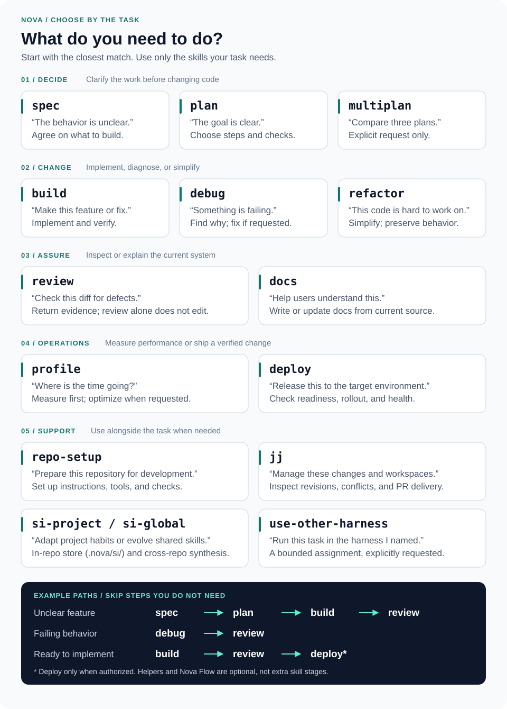

# Nova

**Development skills for Antigravity, Claude Code, and Codex.**

Nova helps your coding agent plan features, fix bugs, review code, and document changes using a shared set of workflows. It runs inside your existing agent conversation and works with your repository’s instructions and checks.

Use one skill for a small task, or move from specification to implementation for a larger change. The parent agent owns decisions, verification, and delivery; native implementers author task-file changes.

[Quick start](#quick-start) · [Usage](#use-nova) · [Skills](#choose-a-skill) · [Installation guide](instructions/install.md) · [Harness comparison](instructions/harnesses.md)

## How Nova works


[View the diagram at full size](docs/diagrams/nova-workflow.svg)

1. **Describe the outcome.** Ask for a feature, a fix, a review, or documentation. Choose a skill when you want a specific workflow.
2. **Work in the conversation.** The parent reads project guidance, applies the skill, and assigns code, tests, docs, configuration, and file-backed reports to a native implementer. Scout and reviewer helpers remain available for bounded investigation and independent review.
3. **Verify the result.** The agent runs relevant checks and inspects the final changes. Failures feed back into the work; remaining limits are reported.
4. **Deliver within your scope.** You receive the result and verification evidence. The delivery summary includes a workflow diagram, key deliverables with file links, verification evidence, and the immutable local `main` commit. When authorized, the parent agent also integrates changes and completes the PR or deployment process.

Small tasks can go straight to the relevant skill. There is no required sequence of skills or mandatory team.

## Quick start

You need **Python 3.11+** and at least one supported CLI already installed and available on `PATH`: `agy`, `claude`, or `codex`. Install repository tools such as jj and your project’s dependencies separately.

```sh
git clone https://github.com/anvil008/nova.git
cd nova

# Preview the installation.
./scripts/bootstrap.sh --dry-run

# Install into the supported CLIs available on this machine.
./scripts/bootstrap.sh
```

Bootstrap installs the native plugins and the `nova-flow` command. It also synchronizes global instruction files for the selected harnesses using ownership checks. If you want to keep global instructions separate, use `--no-align-global`. Existing modified or unmanaged files are preserved; conflicts stop installation with an explanation.

To install only for Codex, including its optional native helpers:

```sh
./scripts/bootstrap.sh --harness codex --with-codex-helpers
```

Use `--harness agy` or `--harness claude` to select either of the other CLIs. Agy and Claude helpers ship inside their plugins. The [installation guide](instructions/install.md) covers updates, custom locations, existing marketplace conflicts, and manual installation.

**Start a new agent session after installation.** Open your project and use Nova’s `repo-setup` skill to record its development commands and reconcile project instructions.

## Use Nova

Select a skill from your harness’s catalog, then describe what you want:

| Harness | Example |
| --- | --- |
| Antigravity | Select the Nova build skill using the name shown in its skill catalog, then describe the feature. |
| Claude Code | `/nova:build Add CSV export to the reports page.` |
| Codex | `$nova:build Add CSV export to the reports page.` |

Other starting points:

- **An idea to work through:** “Use Nova spec to define an offline mode. Ask about the behavior before proposing an implementation.”
- **A reproducible bug:** “Use Nova debug to reproduce this failing test, fix the cause, and verify the result.”
- **A second look:** “Use Nova review to inspect this diff. Report concrete defects without changing files.”
- **A simpler explanation:** “Use Nova docs to update the setup guide from the current code.”

Tell the agent your constraints, such as “review only,” “keep the public API unchanged,” or “open a PR without merging.” Nova’s workflows carry that scope through the task.

## Choose a skill

Match your situation to a skill below. These are entry points, not a required sequence—`debug` can diagnose and repair a bug without a separate `build` task, for example.



[View the skill guide at full size](docs/diagrams/nova-skills.svg)

| Your goal | Skill |
| --- | --- |
| Clarify an idea and agree on behavior | [spec](skills/spec/SKILL.md) |
| Turn a defined change into an implementation plan | [plan](skills/plan/SKILL.md) |
| Explicitly compare plans from Antigravity, Claude, and Codex | [multiplan](skills/multiplan/SKILL.md) |
| Implement a feature or fix | [build](skills/build/SKILL.md) |
| Reproduce a failure and isolate its cause | [debug](skills/debug/SKILL.md) |
| Simplify code while preserving behavior | [refactor](skills/refactor/SKILL.md) |
| Review a diff or pull request | [review](skills/review/SKILL.md) |
| Write documentation grounded in the project | [docs](skills/docs/SKILL.md) |
| Measure performance and verify an optimization | [profile](skills/profile/SKILL.md) |
| Release a verified change to a named environment | [deploy](skills/deploy/SKILL.md) |
| Prepare project instructions and development tools | [repo-setup](skills/repo-setup/SKILL.md) |
| Manage JJ revisions, workspaces, and PR delivery | [jj](skills/jj/SKILL.md) |
| Project-scoped adaptation and self-improvement | [si-project](skills/si-project/SKILL.md) |
| Cross-project pattern synthesis and skill evolution | [si-global](skills/si-global/SKILL.md) |
| Explicitly run a bounded task in another coding harness | [use-other-harness](skills/use-other-harness/SKILL.md) |

Browse the [skill sources](skills/) for their full instructions. Reports default to Markdown; substantial unfinished tasks can retain a checkpoint for resumption.

Nova keeps global defaults and the shared skill instructions short. Detailed integration, reporting, read-routing, and optional Flow procedures are separate references, read only when relevant. Installing the plugin does not preload every reference. See [what loads when](instructions/install.md#instruction-loading).

## Local integration, one publication PR

Each completed workspace result is handed to the parent with its commit and checks. The parent verifies the combined changes and integrates them into **local `main` promptly**, while preserving unrelated active work. Children keep intermediate changes local.

When you authorize publication, the parent pushes one integration bookmark and opens or updates **one PR for the accumulated result**. After merge, it reconciles local main with GitHub, preserves newer local work, and verifies branch cleanup—including superseded PR branches. Remote main stays protected; local integration does not require a PR.

Hooks supply bounded reminders, not proof that work is verified or integrated. The parent owns the actual version-control operations and reports any blocker. See [development conventions](instructions/integration.md#parent-owned-task-integration).

## Helpers and workspace behavior

Nova includes a native **implementer** for every task-file change, plus optional **scout** and **reviewer** helpers for focused investigation and independent inspection. The parent assigns owned paths and acceptance checks, observes the work, then verifies and integrates the result. Independent writers can run in parallel only with disjoint ownership; coupled changes stay serial. See [task-file routing](instructions/write-routing.md).

Packaged read-routing hooks direct recognized large reads toward the existing scout, while focused reads stay in the main conversation. Codex needs `--with-codex-helpers` for native scout setup. See [read routing and fallback](instructions/read-routing.md).

Work that needs isolation uses `.workspaces/<task>/` under the primary checkout. Claude includes native workspace creation and retention hooks; Agy and Codex follow the shared instructions. Native trust settings and desktop app behavior vary—see the [harness comparison](instructions/harnesses.md).

## Hooks: what runs when?

Hooks connect native agent events to small local functions. This map shows what Nova registers, what needs configuration, and what remains disabled.


[View the hook map at full size](docs/diagrams/nova-hooks.svg) · [Hook configuration](hooks/README.md) · [Harness differences](instructions/harnesses.md)

- **Before a read:** recognized large reads receive scout-routing guidance. The hook does not launch a helper itself.
- **Before a task-file edit:** recognized edits receive implementer-routing guidance, and unrecognized calls pass through unchanged (Agy receives an explicit allow). Claude can identify its implementer; Agy and Codex use a supplied argv runner because their pre-tool events cannot safely identify a helper. The hook cannot launch workers or guarantee interception of arbitrary scripts. [Details and limits](instructions/write-routing.md).
- **After delegation:** Claude and Codex use child-stop events; Agy observes successful `invoke_subagent` tool calls. Each can issue one parent continuation reminder to verify results, integrate into local main, and finish authorized publication and cleanup. Known read-only child types—scout, reviewer, Explore, Plan, and similar—do not arm the Claude/Codex reminder; unknown or missing types still do. Agy waits for a normal, fully idle Stop. Hooks never merge changes themselves.
- **When Claude creates or removes an isolated workspace:** the adapter uses the primary checkout’s `.workspaces/` directory and retains work that cannot be safely removed. JJ cleanup stays explicit.
- **After supported editor calls:** formatting and linting run only with an enabled configuration. Claude/Codex use `NOVA_HOOK_CONFIG`; Agy requires explicit adapter setup. These checks do not replace final verification.

Native hook enablement and trust settings still apply. Bootstrap’s compatibility backup runs during installation, helping existing sessions retain their hook entrypoints until restarted.

## Optional: track work with Nova Flow

`nova-flow` provides terminal and browser views of tasks, dependencies, attempts, and parent/helper activity. **Automatic tracking is disabled.** Use it when you explicitly want a tracked run; it is not required to use Nova skills.

From your project directory, start a new run and add a task:

```sh
nova-flow init 'CSV export'
nova-flow task add export 'Implement CSV export' --phase build
nova-flow view
```

Run `nova-flow serve` for the browser view. Add `~/.local/bin` to `PATH` if the command is not found. The [Flow guide](tools/README.md) covers progress updates, verification evidence, usage reporting, and archives.

## Contributing

Build and check changes from the repository root:

```sh
python3 -m pip install -r requirements-dev.txt
python3 -m unittest discover -s tests -v
python3 scripts/update-guide.py --check
python3 scripts/package.py
```

The package builder creates self-contained bundles in `dist/plugins/{agy,claude,codex}/`. Building does not update installed plugins; rerun bootstrap to apply source changes locally.

| Directory | Contents |
| --- | --- |
| [skills/](skills/) | Workflow instructions, references, and report assets |
| [instructions/](instructions/) | Shared conventions and installation guidance |
| [agents/](agents/) | Native helper definitions |
| [hooks/](hooks/) | Read routing, workspace adapters, and optional edit checks |
| [tools/](tools/) | Nova Flow and shared utilities |
| [scripts/](scripts/) | Packaging, bootstrap, and validation |
| [tests/](tests/) | Executable checks |
| [docs/](docs/) | Architecture decisions, guides, and project history |

See [development conventions](instructions/development.md) and the [plugin architecture](docs/adr/0030-shared-skills-native-plugin-delivery.md). Formatter and linter hooks require explicit configuration.

<details>
<summary>Upgrading from the older 0.6 architecture</summary>

Nova replaces the older mandatory role pipeline, sealed-test guard, control plane, and duplicated harness trees. Those designs remain in project history; the current architecture uses shared skills and native plugins.

Disable or uninstall the previous plugin through its native manager before installing this version. Inspect old standalone skills, hooks, and binaries separately: plugin removal may not own them. Building this repository alone does not change existing installations.

</details>
