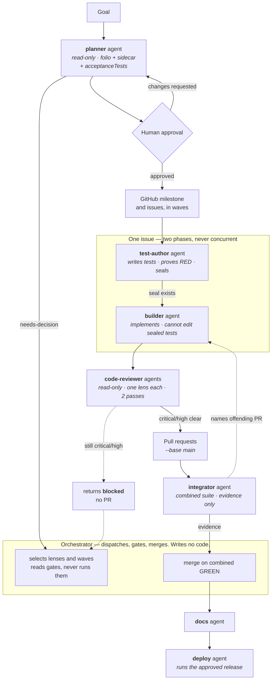
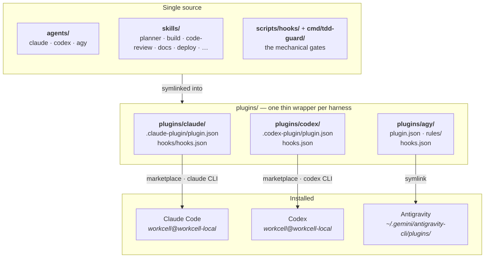
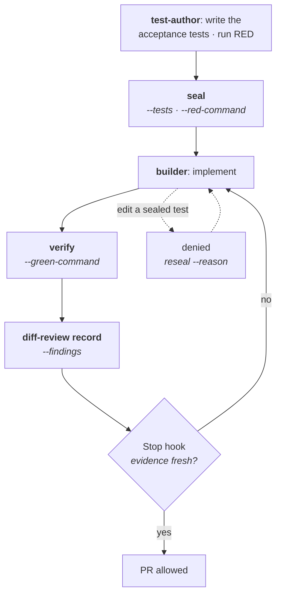

# Workcell

A multi-agent coding system for **Claude Code**, **Codex**, and **Antigravity**.

Like an industrial workcell, it organizes specialized operators and mechanical gates
around one bounded unit of work.

It turns a goal into a reviewable plan, has one agent write each task's tests and a
different one make them pass, and uses mechanical gates — not promises — to keep the
combined result verifiable. The point is to run coding agents in parallel without losing human approval,
test evidence, ownership boundaries, or a resumable GitHub record.

One repository, three harnesses, the same agents and skills in each.

---

## Install

Two commands. The first installs the external tools, the second installs the plugin.

```sh
git clone https://github.com/anvil008/workcell
cd workcell

scripts/bootstrap-tools.sh --install     # 1. external dependencies + the tdd-guard gate
scripts/bootstrap-plugins.sh             # 2. the workcell plugin, into every harness found
```

That is the whole setup. Run either script with no flags to see what it *would* do
before it does anything (`bootstrap-tools.sh` reports; `bootstrap-plugins.sh --help`
explains).

| | What it does |
|---|---|
| `scripts/bootstrap-tools.sh --install` | Installs Go, jq, `jj`, `gh`, formatters and linters where a package manager is available, builds `tdd-guard`, and links the `build-*` hook commands into `~/.local/bin`. |
| `scripts/bootstrap-plugins.sh` | Installs the `workcell` plugin into Claude Code, Codex, and Antigravity — whichever are present. |

Useful flags for the second command:

```sh
scripts/bootstrap-plugins.sh --harness claude   # one harness only (claude | codex | agy)
scripts/bootstrap-plugins.sh --uninstall        # remove everything it installed
```

It never overwrites something it does not own. A real file or directory where a link
should go is refused by name, and the run exits non-zero rather than clobbering it.

### Choosing models and thinking levels

[`agents/models.json`](agents/models.json) is the single source for which model and thinking
level every agent runs at, on every harness. Edit it and re-run `scripts/bootstrap-plugins.sh`;
the installer applies it before installing anything.

```json
"planner": {
  "claude": { "model": "opus", "effort": "xhigh" },
  "codex":  { "effort": "high" },
  "agy":    { "model": "pro" }
}
```

Each harness gets only the knobs it actually honours, which differ more than they look:

| Harness | Model | Thinking level | Where it takes effect |
|---|---|---|---|
| Claude | `opus` / `sonnet` / `haiku` / `inherit` | `low` – `xhigh` | agent frontmatter — fully per-agent |
| Codex | any model id | `low` – `xhigh` | a **profile**, `codex --profile workcell-<agent>` |
| Antigravity | `pro` / `flash` / `inherit` | *(none per-agent)* | agent frontmatter |

Codex reads no per-agent model surface at all — its plugin manifest has no `agents` key, and a
skill's `agents/openai.yaml` is UI metadata only. So the installer also writes
`$CODEX_HOME/workcell-<agent>.config.toml`, which `codex --profile workcell-<agent>` layers over your
base config; that is the half that works today. It never touches a profile it did not write, and
`--uninstall` removes only its own.

Antigravity does have reasoning effort, but session-wide via `/effort` or `--effort` — there is no
frontmatter key, so the manifest deliberately offers none rather than writing a value that does
nothing. Anything an agent leaves out falls back to `defaults`. To apply or verify by hand:

```sh
scripts/sync-agent-models.py                    # write into every agent's frontmatter
scripts/sync-agent-models.py --codex-profiles   # ...and emit the Codex profiles
scripts/sync-agent-models.py --check            # report drift, exit non-zero (what CI runs)
```

### Per-project install

To set up one repository instead of your whole machine:

```sh
scripts/bootstrap-project.sh --install --with-hooks /path/to/project
```

This detects the project's stack, installs the formatters and linters that stack needs,
installs the plugin at project scope, and wires the advisory format/lint/guard hooks
into the project. Everything it writes is added to the repository's `info/exclude`, so
none of it shows up in `git diff` or a commit.

---

## How work moves



In words: the **orchestrator** is the only thing that persists across the whole run, and it
writes nothing. It dispatches a read-only **planner** agent, which investigates and produces the
folio, the sidecar, and each issue's `acceptanceTests` — the TDD Definition of Done. Questions the
planner cannot answer come back as `needs-decision` and the orchestrator puts them to the human; a
plan carrying an unanswered question is not ready for approval. A human approves the folio before
any GitHub resource is written, and that write is the orchestrator's.

Each issue then runs in two phases that never overlap. A **test-author** agent creates the jj
workspace, writes the acceptance tests against the real codebase, proves they fail *on their
assertions* rather than on an import error, and seals them. Only then does a **builder** enter the
same workspace and implement. It cannot weaken what it is judged by: the guard denies edits to
sealed paths outright. Before any PR exists the builder hands its change-set to read-only
**code-reviewer** agents — one per applicable lens, at most two passes — and returns `blocked` with
no PR if a `critical` or `high` finding still stands.

An **integrator** agent then merges the wave's PRs together and runs the full suite on the combined
state, because every PR was tested on its own base. It returns evidence and gate output, never a
verdict. The orchestrator merges on the evidence — visible `commandId`s, `tdd-guard status --json`,
`gh pr checks` — and never on an agent's claim of success. Documentation and deployment follow the
same shape, and deploying stays a separate, explicit human decision.

### Who does what

| Agent | Writes | Owns | Never |
|---|---|---|---|
| orchestrator (you, in the harness) | nothing | dispatch, gates, wave scheduling, merges, verdicts | reads or edits project code, runs test suites, authors artifacts |
| `planner` | plan artifacts | investigation, folio, sidecar, acceptance tests | touches the target project; writes GitHub; answers for the human |
| `test-author` | tests | the Definition of Done: real RED, then the seal | writes an implementation, makes its own test pass |
| `builder` | implementation | one issue, one workspace, one PR | edits sealed tests, pushes `main`, merges its own PR |
| `code-reviewer` | nothing | one assurance lens over one change-set | edits anything it reviews |
| `debugger` | temporary instrumentation only | reproducing a symptom and finding its cause by experiment | ships the fix, leaves instrumentation behind |
| `benchmarker` | nothing | measurement: distributions, run counts, conditions | edits anything it measures, reports a single run |
| `integrator` | nothing | the combined-wave run and its evidence | merges to `main`, fixes what it finds, decides |
| `research` | report artifacts | one assigned area, evidence-backed | changes behaviour; draws the conclusion |
| `docs` | docs | READMEs, ADRs, changelogs, the docs gate | product code |
| `deploy` | release artifacts | one approved release, verify, rollback | deploys without a fresh, explicit approval |

The boundary is written down in [ADR 0007](docs/adr/0007-primary-agent-is-a-pure-orchestrator.md).

---

## How the repository is laid out



In words: `agents/` and `skills/` hold the real content once. The Claude and Antigravity
wrappers are thin — a manifest, hooks, and symlinks back to the agents and skills they
expose — because both follow a symlink that leaves the plugin root.

**Codex does not.** It copies a plugin into `~/.codex/plugins/cache/` on install and
silently drops any symlink pointing outside the plugin root, so a link farm installs as an
empty manifest. `scripts/build-codex-plugin.py` therefore stages a real tree into
`dist/codex/` and the installer registers *that*. Codex also has no plugin-level agent
concept — no `agents` key in its manifest — so each agent ships as a skill named
`agent-<name>` with an `agents/openai.yaml`, which is the one surface that reaches the
model. All 27 arrive namespaced as `workcell:<name>`.

Antigravity provides an `agy plugin` CLI, but its install paths are not a stable documented
contract for this bootstrap flow. Workcell therefore symlinks the wrapper into the known plugin
locations so it stays live as the source tree changes.

| Directory | What lives there |
|---|---|
| [`agents/`](agents/) | Agent definitions per harness — **generated**. Edit [`agents/bodies/`](agents/bodies/) and [`agents/agents.json`](agents/agents.json), then run `scripts/sync-agents.py`. |
| [`skills/`](skills/) | The shared workflows: planner, build, code-review, docs, deploy, and support skills. |
| [`plugins/`](plugins/) | One thin wrapper per harness. No content of its own. |
| [`scripts/`](scripts/) | The three bootstrap commands, plus the hook scripts they install. |
| [`cmd/tdd-guard/`](cmd/tdd-guard/) | The gate binary that binds failing tests, passing tests, and review evidence to an exact change. |
| [`docs/adr/`](docs/adr/) | Architecture decisions and their consequences. |

### Adding an agent

An agent exists three times — `agents/claude/<n>.md`, `agents/codex/<n>.md`,
`agents/agy/<n>/agent.md` — so the body is written once and the variants are derived:

```sh
$EDITOR agents/bodies/<name>.md      # the shared body
$EDITOR agents/agents.json           # description, tools, sandbox per harness
$EDITOR agents/models.json           # model and thinking level per harness
scripts/sync-agents.py               # writes all three variants
```

Where harnesses genuinely differ, the body uses `{{token}}` substitutions and
`<!-- only:codex -->…<!-- end -->` blocks rather than three diverging copies. CI runs
`--check`, so a hand-edit to a generated file fails the build instead of being silently
overwritten later.

Adding a skill means adding a directory under `skills/` — no manifest edit. Claude and
Codex link `skills/` whole; the Antigravity wrapper's per-skill links are regenerated on
every install from `skills/` minus the skills owned by one of its agents.

---

## What you get

Once installed, these workflows are available in each harness.

**Start here — one entry point per kind of work:**

- **`new-feature`** — interviews you first (at least five clarifying questions, unless you
  say skip), then plans, builds test-first, reviews, and opens one PR.
- **`code-analysis`** — hunts real defects, reproduces each as a failing test, fixes it,
  and opens one PR. Correctness only.
- **`code-refactor`** — simplifies without changing behaviour: consolidates modules,
  deletes dead paths, and refuses to touch a test file. One PR.
- **`debug`** — starts from a *reported* symptom: reproduces it, finds the root cause by
  experiment, fixes it test-first, and opens one PR. No reproduction, no fix.
- **`perf`** — measures a baseline, optimizes, and proves the gain is outside the noise.
  Refuses to run without a benchmark harness.
- **`repo-setup`** — makes a repository ready for agentic work: instruction files, build
  runner, version control, and lint/format gates. Existing repo or new one.

**The stages they compose:**

- **`planner`** — dispatches a read-only planner agent that produces an offline HTML plan,
  `plan.sidecar.json`, and each issue's acceptance tests. GitHub reconciliation waits for
  explicit approval.
- **`build`** — executes an approved milestone as resumable dependency waves in isolated
  Jujutsu workspaces, two agents per issue: tests first, then the implementation.
- **`code-review`** — runs independent assurance lenses — correctness and tests always,
  plus security, performance, api-contract, backend, integrations, or frontend as the change
  warrants — verifies candidates adversarially, renders an offline report, and reconciles
  approved findings.
- **`docs`** — keeps READMEs newcomer-friendly, updates documentation in place, records
  ADRs, and runs the documentation gate.
- **`deploy`** — preflight checks, an approved release, post-deploy verification, and
  rollback preparation.

Supporting skills cover research, frontend implementation and review, bounded review/fix
loops, Jujutsu, and explicitly requested alternate harnesses.

`code-refactor` is the one stage that deliberately swaps the TDD gate rather than using it:
`tdd-guard seal` requires a **non-zero** red command, and a refactor's suite is green from the
start. It gates on a captured green baseline plus a diff that touches no test file instead.

## Core guarantees

- **Human gates.** Planning approval and deployment approval are explicit. Silence is
  never treated as consent.
- **Isolated parallel work.** The build skill schedules non-overlapping issues into
  dependency waves and gives each issue its own `jj` workspace.
- **A conductor that plays nothing.** The primary agent dispatches, gates, and merges; it
  never reads or edits project code and never runs a suite
  ([ADR 0007](docs/adr/0007-primary-agent-is-a-pure-orchestrator.md)).
- **Separated authorship.** The agent that writes an issue's tests is never the agent judged
  by them, and the guard enforces it: sealed test paths are denied to the builder.
- **Evidence-bound integration.** An `integrator` retests the combined wave and returns
  command-linked evidence; the orchestrator merges on gate output, never on a claim.
- **Resumable tracking.** Stable markers connect planner sidecars, GitHub milestones,
  issues, reports, and review findings — without GitHub Projects.
- **Accessible communication.** Every meaningful visual is paired with text that conveys
  the same relationships ([ADR 0004](docs/adr/0004-visuals-require-text-equivalents.md)).
- **Cross-harness parity.** The same skills reach all three harnesses; role-specific
  capabilities stay explicit in the agent definitions.

## Mechanical gates

The build wave is bound by `tdd-guard`, which turns TDD from a promise into a state machine — and, because the `test-author` seals and the `builder` implements, into a state machine two different agents pass through. The
guard is a real binary (`cmd/tdd-guard/`, `guard/`), installed by `bootstrap-tools.sh`; the
`scripts/hooks/build-*` commands are what wire it into a harness's tool events.



In words, and in the order the wave hits them:

1. **`tdd-guard seal --tests <globs> --red-command <argv...>`** records the exact failing command and
   a digest of every sealed test file. RED has to be real and non-zero before the seal is taken — and
   *honest*: a test failing with `ImportError` proves nothing about behaviour, so the `test-author`
   writes signature-only stubs where needed to make the failure land on the assertion.
2. **While implementing, sealed tests are read-only** — and they are not the builder's tests. A `PreToolUse` edit of a sealed path is
   *denied*, not warned about; changing one out-of-band is flagged the moment the guard sees it. The
   only legitimate amendment is `tdd-guard reseal --reason <text>`, after proving the amended test
   fails for the intended reason.
3. **`tdd-guard verify --green-command <argv...>`** accepts the run only if the tests are byte-identical
   to the seal and the GREEN run *postdates* it. Optional `--coverage-command` and `--min-coverage`
   add a coverage floor; `tdd-guard arch-check --assertions <file>` asserts structural invariants.
4. **`tdd-guard diff-review record --findings <file>`** binds review findings to the current diff. Change
   the diff afterwards and the record goes stale.
5. **`tdd-guard handoff --to builder`** ends the `test-author`'s turn. The Stop gate is written for an
   implementer, so without this a sealing agent would deadlock on GREEN evidence it is not allowed to
   produce. It relaxes the Stop gate only — `ready` stays false until the implementation exists.
6. **The Stop hook refuses to let a builder finish** while any of that is missing: sealed tests changed
   without a recorded amendment, no green evidence, green evidence older than the current seal, or a
   missing/stale diff review. `tdd-guard status --json` reports the same state for a human or the
   orchestrator, and it is the gate that decides a merge — a handoff never satisfies it.

Alongside the TDD state machine, `build-guard` inspects each shell command *before* it runs and fails
closed on malformed tool payloads, protected-branch mutations, unsafe Git/jj/GitHub operations, and
RAM-tmpfs build targets. `build-format` and `build-lint` auto-format written files and feed
single-file lint findings back to the agent.

Claude Code, Antigravity, and Codex wire these to native tool events. Codex plugin hooks remain
inactive until the user trusts them with `/hooks`, so its agent definitions also document explicit
`build-guard codex` and `tdd-guard` commands as the fallback for untrusted or ad-hoc sessions.

---

## Verify the repository

The same substantive checks CI runs:

```sh
go mod tidy && git diff --exit-code -- go.mod go.sum
go build ./... && go vet ./... && go test -count=1 -race ./...
bash scripts/hooks/tests/test_hooks.sh
bash scripts/tests/test_install.sh
ruff check skills/
shellcheck -S warning scripts/*.sh scripts/hooks/build-*
for d in skills/*/tests; do python3 -m unittest discover -s "$d" -p 'test_*.py'; done
python3 skills/docs/scripts/docs_check.py .
```

Architecture decisions live in [`docs/adr/`](docs/adr/); notable changes are summarized
in [`CHANGELOG.md`](CHANGELOG.md).

## Upgrading from an earlier install

Earlier versions linked agents and skills straight into `~/.claude/agents`,
`~/.codex/skills`, and friends, and later linked plugin wrappers into
`~/.claude/plugins/`. Neither Claude Code nor Codex ever discovered those links.

```sh
scripts/bootstrap-plugins.sh --uninstall   # sweeps the legacy links
scripts/bootstrap-plugins.sh               # installs through the marketplaces
```

See [ADR 0006](docs/adr/0006-plugins-install-through-local-marketplaces.md) for why the
mechanism changed.
