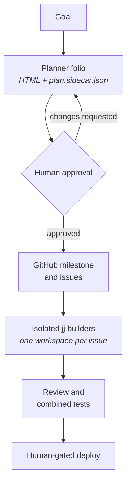
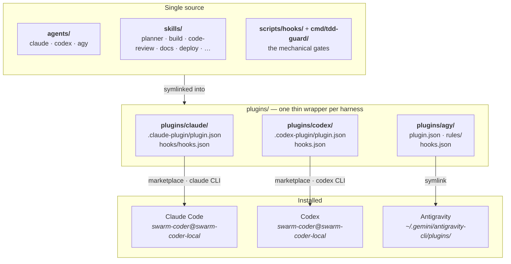

# Swarm Coder

A multi-agent coding system for **Claude Code**, **Codex**, and **Antigravity**.

It turns a goal into a reviewable plan, hands each implementation task to an isolated
builder, and uses mechanical gates — not promises — to keep the combined result
verifiable. The point is to run coding agents in parallel without losing human approval,
test evidence, ownership boundaries, or a resumable GitHub record.

One repository, three harnesses, the same agents and skills in each.

---

## Install

Two commands. The first installs the external tools, the second installs the plugin.

```sh
git clone https://github.com/anvil008/swarm-coder
cd swarm-coder

scripts/bootstrap-tools.sh --install     # 1. external dependencies + the tdd-guard gate
scripts/bootstrap-plugins.sh             # 2. the swarm-coder plugin, into every harness found
```

That is the whole setup. Run either script with no flags to see what it *would* do
before it does anything (`bootstrap-tools.sh` reports; `bootstrap-plugins.sh --help`
explains).

| | What it does |
|---|---|
| `scripts/bootstrap-tools.sh --install` | Installs Go, jq, `jj`, `gh`, formatters and linters where a package manager is available, builds `tdd-guard`, and links the `build-*` hook commands into `~/.local/bin`. |
| `scripts/bootstrap-plugins.sh` | Installs the `swarm-coder` plugin into Claude Code, Codex, and Antigravity — whichever are present. |

Useful flags for the second command:

```sh
scripts/bootstrap-plugins.sh --harness claude   # one harness only (claude | codex | agy)
scripts/bootstrap-plugins.sh --uninstall        # remove everything it installed
```

It never overwrites something it does not own. A real file or directory where a link
should go is refused by name, and the run exits non-zero rather than clobbering it.

### Per-project install

To set up one repository instead of your whole machine:

```sh
scripts/bootstrap-project.sh --install --with-hooks /path/to/project
```

This detects the project's stack, installs the formatters and linters that stack needs,
installs the plugin at project scope, and wires the advisory format/lint/guard hooks
into the project. Everything it writes is added to the repository's `info/exclude`, so
none of it shows up in `git diff` or a commit.

---

## How work moves



In words: the planner turns a goal into an HTML folio plus a machine-readable sidecar.
A human reviews that plan before any GitHub resource is written. Approved issues then
run in dependency waves, each builder isolated in its own Jujutsu workspace. Review and
the combined test suite must pass before integration. Deployment stays a separate human
decision.

---

## How the repository is laid out



In words: `agents/` and `skills/` hold the real content once. Each `plugins/<harness>/`
directory is a thin wrapper — a manifest, a `hooks.json`, and symlinks back to the
agents and skills it exposes. Claude Code and Codex install that wrapper through a local
marketplace declared at the repository root, using their own CLIs. Antigravity has no
plugin CLI, so its wrapper is symlinked into place and stays live.

| Directory | What lives there |
|---|---|
| [`agents/`](agents/) | Agent definitions per harness: research, builder, code-reviewer, docs. |
| [`skills/`](skills/) | The shared workflows: planner, build, code-review, docs, deploy, and support skills. |
| [`plugins/`](plugins/) | One thin wrapper per harness. No content of its own. |
| [`scripts/`](scripts/) | The three bootstrap commands, plus the hook scripts they install. |
| [`cmd/tdd-guard/`](cmd/tdd-guard/) | The gate binary that binds failing tests, passing tests, and review evidence to an exact change. |
| [`docs/adr/`](docs/adr/) | Architecture decisions and their consequences. |

Adding a skill means adding a directory under `skills/` — no manifest edit. Claude and
Codex link `skills/` whole; the Antigravity wrapper's per-skill links are regenerated on
every install from `skills/` minus the skills owned by one of its agents.

---

## What you get

Once installed, these workflows are available in each harness:

- **`planner`** — investigates a substantial change and produces an offline HTML plan
  plus `plan.sidecar.json`. GitHub reconciliation waits for explicit approval.
- **`build`** — executes an approved milestone as resumable dependency waves in isolated
  Jujutsu workspaces.
- **`code-review`** — runs independent assurance lenses, verifies candidates, renders an
  offline report, and reconciles approved findings.
- **`docs`** — keeps READMEs newcomer-friendly, updates documentation in place, records
  ADRs, and runs the documentation gate.
- **`deploy`** — preflight checks, an approved release, post-deploy verification, and
  rollback preparation.

Supporting skills cover research, frontend implementation and review, bounded review/fix
loops, Jujutsu, and explicitly requested alternate harnesses.

## Core guarantees

- **Human gates.** Planning approval and deployment approval are explicit. Silence is
  never treated as consent.
- **Isolated parallel work.** The build skill schedules non-overlapping issues into
  dependency waves and gives each builder its own `jj` workspace.
- **Evidence-bound integration.** Builders prove RED then GREEN, review their own diff,
  and return command-linked evidence. The primary agent retests the combined wave.
- **Resumable tracking.** Stable markers connect planner sidecars, GitHub milestones,
  issues, reports, and review findings — without GitHub Projects.
- **Accessible communication.** Every meaningful visual is paired with text that conveys
  the same relationships ([ADR 0004](docs/adr/0004-visuals-require-text-equivalents.md)).
- **Cross-harness parity.** The same skills reach all three harnesses; role-specific
  capabilities stay explicit in the agent definitions.

## Mechanical gates

The guard and hooks enforce what prose cannot:

1. `tdd-guard seal` records an exact failing test command and a sealed test digest.
2. `tdd-guard verify` accepts that same command only after it passes, with no test
   tampering.
3. `tdd-guard diff-review record` binds review findings to the current diff.
4. `tdd-guard status --json` reports whether the evidence is fresh and integration-ready.

The build guard also fails closed on malformed tool payloads, protected-branch
mutations, unsafe Git/jj/GitHub operations, and RAM-tmpfs build targets. Formatting and
lint hooks give file-level feedback. Claude and Antigravity wire the supported events
natively; Codex builders call the equivalent guard commands explicitly.

---

## Verify the repository

The same substantive checks CI runs:

```sh
go mod tidy && git diff --exit-code -- go.mod go.sum
go build ./... && go vet ./... && go test -count=1 -race ./...
bash scripts/hooks/tests/test_hooks.sh
bash scripts/tests/test_install.sh
ruff check skills/
shellcheck -S warning scripts/*.sh scripts/hooks/build-*
for d in skills/*/tests; do python3 -m unittest discover -s "$d" -p 'test_*.py'; done
python3 skills/docs/scripts/docs_check.py .
```

Architecture decisions live in [`docs/adr/`](docs/adr/); notable changes are summarized
in [`CHANGELOG.md`](CHANGELOG.md).

## Upgrading from an earlier install

Earlier versions linked agents and skills straight into `~/.claude/agents`,
`~/.codex/skills`, and friends, and later linked plugin wrappers into
`~/.claude/plugins/`. Neither Claude Code nor Codex ever discovered those links.

```sh
scripts/bootstrap-plugins.sh --uninstall   # sweeps the legacy links
scripts/bootstrap-plugins.sh               # installs through the marketplaces
```

See [ADR 0006](docs/adr/0006-plugins-install-through-local-marketplaces.md) for why the
mechanism changed.
