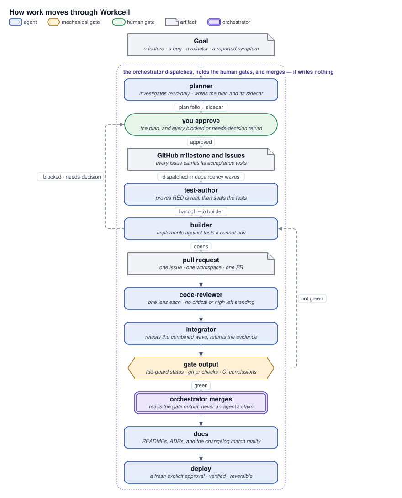
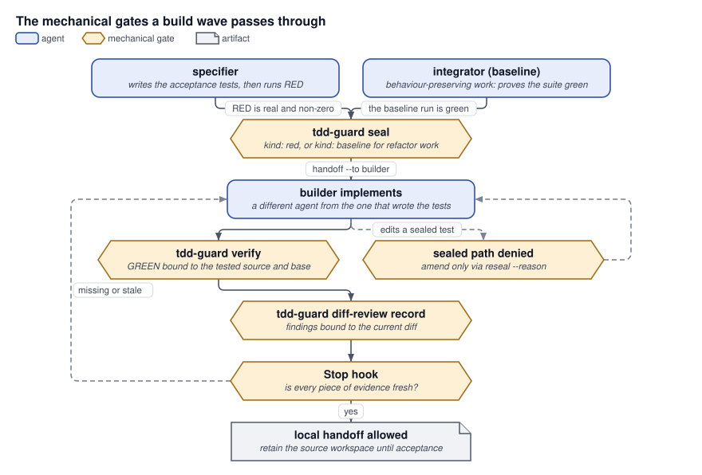

# Workcell

**A multi-agent coding system for Claude Code, Codex, Antigravity, and Grok Build — one agent writes each task's tests, a different one makes them pass, and mechanical gates decide, not promises.**

Like an industrial workcell, it organizes specialized operators and mechanical gates around one bounded unit of work. It turns a goal into a reviewable plan, then runs coding agents in parallel without losing human approval, test evidence, ownership boundaries, or a resumable GitHub record. One repository, four harnesses, the same agents and skills in each.

## Lifecycle

```
Plan → Approve → Tests → Build → Review → Integrate → Merge → Docs → Deploy
```

| Stage     | Who          | What has to be true before the next stage                                |
| --------- | ------------ | ------------------------------------------------------------------------ |
| Plan      | `planner`    | Offline plan + `plan.sidecar.json`, every issue carries acceptance tests |
| Approve   | you (human)  | Explicit approval — silence is never consent                             |
| Tests     | `specifier`  | RED is real and honest, then sealed                                      |
| Build     | `builder`    | Implements against tests it cannot edit                                  |
| Review    | `reviewer`   | No `critical`/`high` finding left standing                               |
| Integrate | `integrator` | Combined wave retested, evidence returned                                |
| Merge     | orchestrator | Reads gate output, never a claim                                         |
| Docs      | `documenter` | READMEs and ADRs match reality                                           |
| Deploy    | `deployer`   | Fresh, explicit approval; verified; reversible                           |

## Workflows

| You're doing                         | Skill             | Key principle                                             |
| ------------------------------------ | ----------------- | --------------------------------------------------------- |
| Build a new feature                  | `new-feature`     | Interview before you plan — five questions, minimum       |
| Sweep for real bugs                  | `code-analysis`   | Every fix ships with a test that failed first             |
| Simplify without changing behaviour  | `code-refactor`   | Behaviour-preserving only; never touches a test file      |
| Chase a reported symptom             | `debug`           | No reproduction, no fix                                   |
| Make something measurably faster     | `perf`            | Refuses to run without a benchmark harness                |
| Get a repo ready for agents          | `repo-setup`      | Gates before agents                                       |
| Plan before you build                | `planner`         | No GitHub write before human approval                     |
| Execute an approved plan             | `build`           | Tests first, then the implementation — never concurrent   |
| Review before merge                  | `code-review`     | Blocked, not merged, on a standing critical/high finding  |
| Standardize documentation            | `docs`            | Update in place; one canonical place per topic            |
| Ship a verified change               | `deploy`          | No deploy without a fresh, explicit approval              |
| Investigate across areas in parallel | `research`        | Evidence, not conclusions                                 |
| Bound a review/fix cycle             | `review-fix-loop` | Stops when nothing's left to fix, or fixing stops working |

## Quick Start

One command. It installs [apm](https://github.com/microsoft/apm) when absent, then the external
tools, then the plugin — everything at user (global) level.

```sh
git clone https://github.com/anvil008/workcell
cd workcell

scripts/bootstrap.sh
```

It is a thin orchestrator over two scripts you can also run (and re-run) individually:

```sh
scripts/bootstrap-tools.sh --install     # 1. external dependencies + the tdd-guard gate
scripts/bootstrap-plugins.sh             # 2. the workcell plugin, into every harness found
```

Run either script with no flags to see what it _would_ do first. Useful flags for the second:

```sh
scripts/bootstrap-plugins.sh --harness claude   # one harness only (claude | codex | agy | grok)
scripts/bootstrap-plugins.sh --uninstall        # remove everything it installed
```

It never overwrites something it does not own — a destination that is not its own copy is refused
by name, and an uninstall leaves anything you have since edited in place and says so. Model/effort
configuration, a per-project install, and upgrading from an earlier install are covered in
**[docs/install.md](docs/install.md)**.

## All 16 skills

**Entry points — one PR, start to finish:** `new-feature`, `code-analysis`, `code-refactor`,
`debug`, `perf`, `repo-setup` (see [Workflows](#workflows) for what each guarantees).

| Phase    | Skill                                                                  | One line                                                                                                    |
| -------- | ---------------------------------------------------------------------- | ----------------------------------------------------------------------------------------------------------- |
| Plan     | [`plan`](skills/plan/SKILL.md)                                   | Investigates, then produces an offline plan and each issue's acceptance tests                               |
| Build    | [`build`](skills/build/SKILL.md)                                       | Runs an approved milestone as resumable dependency waves, in single-PR mode when an entry workflow needs it |
| Review   | [`code-review`](skills/code-review/SKILL.md)                           | Multi-lens, adversarially verified review of a PR, diff, or change-set                                      |
| Review   | [`review-fix-loop`](skills/review-fix-loop/SKILL.md)                   | Bounded review-then-fix cycle on a dedicated loop branch                                                    |
| Research | [`research`](skills/research/SKILL.md)                                 | Parallel read-only investigation merged into one evidence packet                                            |
| Docs     | [`docs`](skills/docs/SKILL.md)                                         | Standardizes and updates documentation, records ADRs, runs the docs gate                                    |
| Deploy   | [`deploy`](skills/deploy/SKILL.md)                                     | Preflight, approved release, post-deploy verification, rollback path                                        |
| Memory   | [`wiki`](skills/wiki/SKILL.md)                                         | Consolidates a project's finished runs into a persistent namespace outside the repository                   |
| Support  | [`jj`](skills/jj/SKILL.md)                                             | Jujutsu version control for repositories that use it                                                        |
| Support  | [`use-other-harness`](skills/use-other-harness/SKILL.md)               | Explicit, user-triggered escape hatch to run a subagent in a different harness                              |

**The wiki layer** is what one project remembers about itself: write-once evidence from finished
runs, append-only pages about the failure modes and strategies that recur, and a catalog over
them. It lives outside every repository — at `$WORKCELL_WIKI_HOME`, default `~/.workcell/wiki/`,
one namespace per project — so it outlives every branch, worktree, and clone, and no working
copy, pull request, or scored eval patch can carry it. It is deliberately not a memory the
runtime agents read, not a shared brain across projects, and not a back door into Workcell's own
shared workflows, which keep changing only through evidence-backed pull requests. A project opts
in when a human creates its namespace; without one, nothing is recorded and nothing changes.
The decision is [ADR 0019](docs/adr/0019-the-wiki-lives-outside-every-repository.md).

## Who does what

| Agent                              | Writes                                    | Owns                                                      | Never                                                            |
| ---------------------------------- | ----------------------------------------- | --------------------------------------------------------- | ---------------------------------------------------------------- |
| orchestrator (you, in the harness) | nothing                                   | dispatch, gates, wave scheduling, merges, verdicts        | reads or edits project code, runs test suites, authors artifacts |
| `planner`                          | plan artifacts                            | investigation, folio, sidecar, acceptance tests           | touches the target project; writes GitHub; answers for the human |
| `specifier`                        | tests                                     | the Definition of Done: real RED, then the seal           | writes an implementation, makes its own test pass                |
| `builder`                          | implementation                            | one issue, one workspace, one PR                          | edits sealed tests, pushes `main`, merges its own PR             |
| `reviewer`                         | nothing                                   | one assurance lens over one change-set                    | edits anything it reviews                                        |
| `debugger`                         | temporary instrumentation only            | reproducing a symptom and finding its cause by experiment | ships the fix, leaves instrumentation behind                     |
| `profiler`                         | nothing                                   | measurement: distributions, run counts, conditions        | edits anything it measures, reports a single run                 |
| `integrator`                       | nothing                                   | the combined-wave run and its evidence                    | merges to `main`, fixes what it finds, decides                   |
| `researcher`                       | findings envelope (returned, not written) | one assigned area, evidence-backed                        | writes report artifacts; draws the conclusion                    |
| `documenter`                       | docs                                      | READMEs, ADRs, changelogs, the docs gate                  | product code                                                     |
| `deployer`                         | release artifacts                         | one approved release, verify, rollback                    | deploys without a fresh, explicit approval                       |

The boundary is written down in [ADR 0007](docs/adr/0007-primary-agent-is-a-pure-orchestrator.md);
the dispatch and return shape every agent uses is [`agents/handoff.md`](agents/handoff.md)
([ADR 0008](docs/adr/0008-agent-handoff-contract.md)).

## How it works

**The orchestrator writes nothing and merges on gate output.** It dispatches agents, holds human
gates, and runs `git`/`jj`/`gh` for branch and merge operations — but it never reads or edits
project code, never runs a test suite, and never authors an artifact. It decides by reading
evidence a machine produced (`tdd-guard status --json`, `gh pr checks`, CI conclusions), not by
believing an agent's summary. See [ADR 0007](docs/adr/0007-primary-agent-is-a-pure-orchestrator.md).

<picture>
  <source media="(prefers-color-scheme: dark)" srcset="docs/diagrams/how-work-moves-dark.svg">
  
</picture>

In words: a goal becomes a plan; the plan waits for your approval; only then does it become a GitHub
milestone and its issues. Each issue is dispatched as soon as its own `dependsOn` have landed,
whatever wave it was planned into
([ADR 0017](docs/adr/0017-the-build-wave-overlaps-where-the-seal-allows.md)) — a `specifier` seals
its tests, a `builder` implements against tests it cannot edit, and `reviewer`s take one lens each
over the change-set _before any pull request exists_, at most two passes. Only a change-set with no
`critical` or `high` finding left standing becomes a pull request. An `integrator` then retests the
combined wave, and the `documenter` is dispatched alongside the `integrator` rather than after it,
so the two work at the same time and one gate output covers the code and its documentation
together. The orchestrator merges only on that gate — the one covering both — and only when it is
green; `deployer` runs later, on a fresh approval. The documenter overlap is wired in the
`new-feature` workflow today; `build`'s own loop stops at the merge, and a milestone driven
straight from it takes its documentation from a separately invoked `docs` pass. An agent's own claim of success is never the
input to a merge decision — only a gate a machine ran is. Work that fails a gate returns to the
builder; a finding that still stands after two passes returns as `blocked`, with no PR opened at
all.

**Authorship is separated and enforced by `tdd-guard`.** A `specifier` proves RED and seals the
tests; the `builder` implements against them and is mechanically denied any edit to a sealed path.
For behaviour-preserving `code-refactor`/`perf` work, an `integrator` instead proves the baseline
GREEN and takes a **baseline seal** — no `specifier`, no touched tests. Either way the Stop hook
refuses to let the builder finish without fresh GREEN evidence that postdates the seal.

<picture>
  <source media="(prefers-color-scheme: dark)" srcset="docs/diagrams/mechanical-gates-dark.svg">
  
</picture>

In words: the agent judged by the tests is never the agent who wrote them, and the guard — not a
convention — is what makes that true. A `specifier` proves RED and seals, or for
behaviour-preserving work an `integrator` seals a green baseline; the `builder` then implements, and
an edit of a sealed path is denied rather than warned about, amendable only through
`reseal --reason`. `verify` accepts only a GREEN run that postdates the seal, `diff-review record`
binds findings to the current diff, and the Stop hook allows a pull request only when all of that
evidence is fresh — otherwise it sends the builder back. The full gate-by-gate walkthrough is
**[docs/gates.md](docs/gates.md)**; the mode is [ADR 0009](docs/adr/0009-skills-are-dispatch-contracts.md).

## How the repository is laid out

```
workcell/
├── agents/            generated per harness — edit agents/bodies/ + agents.json, then sync-agents.py
├── skills/             16 shared workflows: plan, build, code-review, docs, deploy, …
├── plugins/            one thin wrapper per harness — no content of its own
│   ├── claude/          .claude-plugin/plugin.json, hooks/hooks.json — staged, then copied to ~/.local/share/workcell/claude
│   ├── codex/           .codex-plugin/plugin.json, hooks/hooks.json — staged, then copied to ~/.local/share/workcell/codex
│   ├── agy/             plugin.json, rules/, hooks.json — staged, then copied to ~/.gemini/config/plugins/workcell; never linked
│   └── grok/            .claude-plugin/plugin.json — staged, then copied to ~/.grok/plugins/workcell; no hooks
├── scripts/            scripts/bootstrap.sh (one command) over bootstrap-tools.sh / bootstrap-plugins.sh / bootstrap-project.sh, the four build-*-plugin.py stagers, build-guard-release.py, the hook scripts they install, workcell-ws
├── cmd/tdd-guard/      the gate binary binding RED, GREEN, and review evidence to one diff
├── docs/adr/           architecture decisions and their consequences
├── docs/workspaces.md  the one isolation standard: workcell-ws, sibling paths, the sweep
├── docs/diagrams/      the README's visuals: JSON sources in src/, generated light and dark SVG
└── evals/              structural, routing, and behavioral checks on skills and agents
```

`plugins/claude/`, `plugins/codex/`, `plugins/agy/`, and `plugins/grok/` are one thin wrapper per
harness — a manifest, hooks, and, where the harness's layout needs them, references back to
`agents/` and `skills/`, with no content of their own (Grok ships no hooks of its own — see
[docs/gates.md](docs/gates.md)). The Antigravity
wrapper's per-skill entries regenerate on every install from `skills/` minus the skills owned by
one of its agents. Grok reads `.claude-plugin/`-style manifests directly and aliases
`CLAUDE_PLUGIN_ROOT` for hooks
([ADR 0020](docs/adr/0020-apm-is-a-peer-tool-not-the-distribution-layer.md)), so adding it cost one
staging script and a bootstrap section, not a new plugin format.

Every harness install is an installer-owned copy of a staged tree; no harness loads code out of
this checkout. `scripts/build-claude-plugin.py`, `build-codex-plugin.py`, `build-agy-plugin.py`,
and `build-grok-plugin.py` each stage a tree with no links escaping it, and
`scripts/bootstrap-plugins.sh` copies that tree to a path it owns. Claude and Codex resolve
theirs through a durable marketplace under `~/.local/share/workcell/`; Antigravity and Grok
register nothing, because each already scans its own plugin directory, so they get one owned copy
at `~/.gemini/config/plugins/workcell` and one at `~/.grok/plugins/workcell` — a real directory
each, not a link. The `~/.gemini/antigravity-cli/plugins/` location earlier versions also wrote
to is retired and never recreated, so Antigravity has one loadable copy rather than two. The
`.claude-plugin/marketplace.json` and `.agents/plugins/marketplace.json` manifests that used to
sit at the repository root are retired.
[ADR 0023](docs/adr/0023-installs-are-self-contained-copies.md) records the decision,
[docs/install.md](docs/install.md) the refresh story that comes with it, and
[the Codex installation details](docs/install.md#choosing-models-and-thinking-levels) how its
agents and shared skills are packaged and named.

## Evals

Three tiers, from [`evals/README.md`](evals/README.md):

1. **Structural** (free, CI) — skill frontmatter, case coverage, trigger counts, fixture paths.
2. **Routing** (free, CI) — TF-IDF cosine ranking; positive prompts must retrieve their case,
   negatives must prefer their declared owner.
3. **Behavioral** (on demand, spends tokens) — runs Claude Code or Codex headlessly against a
   fixture repo and grades the trace.

```sh
python3 evals/run_evals.py --structural
python3 evals/run_evals.py --min-rank1 77
python3 -m unittest discover -s evals/tests -p 'test_*.py'
```

## Verify the repository

The same substantive checks CI runs:

```sh
python3 -m pip install ruff
go mod tidy
git diff --exit-code -- go.mod go.sum
go build ./...
go vet ./...
go test -count=1 -race ./...
bash scripts/hooks/tests/test_hooks.sh
bash scripts/hooks/tests/test_plugin_hooks.sh
bash scripts/tests/test_install.sh
bash scripts/tests/test_workcell_ws.sh
python3 -m unittest discover -s scripts/tests -p 'test_*.py'
ruff check skills/ evals/ scripts/render-diagrams.py
shellcheck -S warning scripts/*.sh scripts/hooks/build-* scripts/workcell-ws
for d in skills/*/tests; do python3 -m unittest discover -s "$d" -p 'test_*.py'; done
python3 evals/run_evals.py --structural
python3 evals/run_evals.py --min-rank1 77
python3 -m unittest discover -s evals/tests -p 'test_*.py'
python3 skills/docs/scripts/docs_check.py .
python3 scripts/sync-agents.py --check --diff
python3 scripts/sync-agent-models.py --check
python3 scripts/render-diagrams.py --check
```

Architecture decisions live in [`docs/adr/`](docs/adr/); notable changes are summarized in
[`CHANGELOG.md`](CHANGELOG.md).

## Contributing

**Adding an agent.** An agent exists three times — `agents/claude/<n>.md`, `agents/codex/<n>.md`,
`agents/agy/<n>/agent.md` — written once and derived:

```sh
$EDITOR agents/bodies/<name>.md      # the shared body
$EDITOR agents/agents.json           # description, tools, sandbox per harness
$EDITOR agents/models.json           # model and thinking level per harness
scripts/sync-agents.py               # writes all three variants
```

Where harnesses genuinely differ, the body uses `{{token}}` substitutions and
`<!-- only:codex -->…<!-- end -->` blocks rather than three diverging copies. CI runs `--check`, so
a hand-edit to a generated file fails the build instead of being silently overwritten.

**Adding a skill.** Add a directory under `skills/` — no manifest edit needed.
