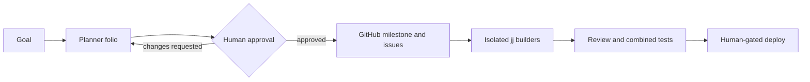

# Swarm Coder

Swarm Coder is a small multi-agent coding system for Claude Code, Codex, and
Antigravity. It turns a goal into a reviewable plan, gives each implementation task to
an isolated builder, and uses mechanical gates to keep the combined result verifiable.

It exists so teams can use parallel coding agents without losing human approval,
test evidence, ownership boundaries, or a resumable GitHub record.

## Quickstart

From this repository, install the agents, skills, and guard commands into every
supported harness already present on your machine:

```sh
scripts/install-harness.sh --install
```

To install one harness only, add `--harness claude`, `--harness codex`, or
`--harness agy`. Run `scripts/install-harness.sh --uninstall` to remove only the
symlinks owned by this repository.

## How work moves



In words: the planner turns a goal into an HTML folio and machine-readable sidecar.
A human reviews that plan before GitHub resources are written. Approved issues run in
dependency waves, with each builder isolated in its own Jujutsu workspace. Review and
combined tests must pass before integration, and deployment remains a separate human
decision.

## What is included

| Area | Purpose |
|---|---|
| [`agents/`](agents/) | Harness-specific definitions for research, building, review, and docs work. |
| [`skills/`](skills/) | The shared planner, build, review, docs, deploy, and supporting workflows. |
| [`cmd/tdd-guard/`](cmd/tdd-guard/) | Binds failing tests, passing tests, and review evidence to the exact change. |
| [`scripts/hooks/`](scripts/hooks/) | Blocks unsafe commands and provides formatting, lint, and TDD feedback. |
| [`docs/adr/`](docs/adr/) | Durable architecture decisions and their consequences. |

The repository is the single source of truth. The installer projects agents and skills
into each harness with symlinks, so most source edits take effect immediately. Codex
agent definitions are the exception: the installer renders their Markdown into
gitignored TOML before linking it into the harness.

## Core guarantees

- **Human gates:** planning approval and deployment approval are explicit; silence is
  never treated as consent.
- **Isolated parallel work:** the build skill schedules non-overlapping issues into
  dependency waves and gives each builder its own `jj` workspace.
- **Evidence-bound integration:** builders prove RED then GREEN, review their own diff,
  and return command-linked evidence. The primary agent retests the combined wave.
- **Resumable tracking:** stable markers connect planner sidecars, GitHub milestones,
  issues, reports, and review findings without using GitHub Projects.
- **Accessible communication:** user-facing docs and reports pair meaningful visuals
  with concise text that conveys the same relationships. Planner folios compare current
  and proposed states; code-review reports show how candidates become verified findings.
- **Cross-harness parity:** centralized skills are installed into Claude Code, Codex,
  and Antigravity, while role-specific capabilities remain explicit in agent definitions.

## Use the workflows

- `planner` investigates a substantial change and produces an offline HTML plan plus
  `plan.sidecar.json`. GitHub reconciliation waits for explicit approval.
- `build` executes an approved milestone as resumable dependency waves in isolated
  Jujutsu workspaces.
- `code-review` runs independent assurance lenses, verifies candidates, renders an
  offline report, and reconciles approved findings.
- `docs` keeps READMEs newcomer-friendly, updates documentation in place, records ADRs,
  and runs the documentation gate.
- `deploy` performs preflight checks, an approved release, post-deploy verification,
  and rollback preparation.

Supporting skills cover research, frontend implementation and review, bounded
review/fix loops, Jujutsu, and explicitly requested alternate harnesses. Every directory
under `skills/` is discovered automatically; adding a skill does not require an
installer manifest change.

To prepare a target repository after installing the harness, run:

```sh
scripts/project-bootstrap.sh --install --with-hooks /path/to/project
```

The bootstrap detects the project stack, installs available hook tools, and connects the
advisory formatting and lint feedback supported by that harness.

## Unified Plugin Architecture

Swarm Coder provides a unified cross-harness plugin architecture. The plugin layout is structured under the `plugins/` directory, which contains harness-specific plugin wrappers:
- `plugins/agy/swarm-coder` for Antigravity (`~/.gemini/antigravity-cli/plugins/swarm-coder`)
- `plugins/claude/swarm-coder` for Claude Code
- `plugins/codex/swarm-coder` for Codex

Installation commands for all three harnesses:
- **Global Install**: Run `scripts/install-harness.sh --install` to link the plugin into your home directory for each detected harness.
- **Workspace Local**: Run `scripts/project-bootstrap.sh --install` to link the plugin directly into `.agents/plugins`, `.claude/plugins`, and `.codex/plugins` within the current project repository. These links are automatically excluded from Git tracking.

**Migration Notes**: Earlier versions placed agents and skills directly in `~/.claude/agents` or `~/.codex/skills`. The new architecture installs everything via the unified `plugins/` directory. Run `scripts/install-harness.sh --uninstall` to clean up any legacy artifacts before running the new install command.

## Mechanical gates

The guard and hooks enforce the boundaries that prose alone cannot:

1. `tdd-guard seal` records an exact failing test command and sealed test digest.
2. `tdd-guard verify` accepts that same command only after it passes without test
   tampering.
3. `tdd-guard diff-review record` binds review findings to the current diff.
4. `tdd-guard status --json` exposes whether the evidence is fresh and integration-ready.

The build guard also fails closed on malformed tool payloads, protected-branch
mutations, unsafe Git/jj/GitHub operations, and RAM-tmpfs build targets. Formatting and
lint hooks provide file-level feedback. Claude and Antigravity wire supported events
natively; Codex builders run the equivalent guard commands explicitly.

## Verify the repository

Run the same substantive checks used by CI:

```sh
go mod tidy
go build ./...
go vet ./...
go test -count=1 -race ./...
bash scripts/hooks/tests/test_hooks.sh
bash scripts/tests/test_install.sh
ruff check skills/
shellcheck -S warning scripts/*.sh scripts/hooks/build-*
for d in skills/*/tests; do python3 -m unittest discover -s "$d" -p 'test_*.py'; done
python3 skills/docs/scripts/docs_check.py .
```

CI also checks that `go mod tidy` leaves `go.mod` and `go.sum` unchanged. Generated
planner folios live in [`docs/plans/`](docs/plans/), and the root
[`plan.sidecar.json`](plan.sidecar.json) describes the current plan.

Architecture decisions are recorded in [`docs/adr/`](docs/adr/), and notable changes
are summarized in [`CHANGELOG.md`](CHANGELOG.md).
