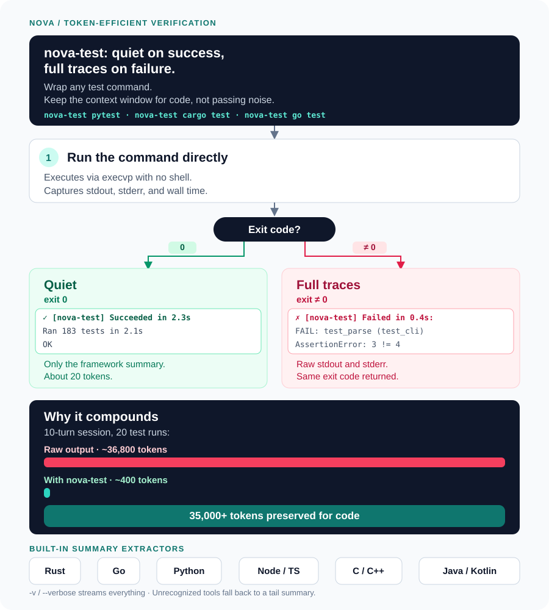

# Nova

**Development skills for Antigravity, Claude Code, and Codex.**

Nova helps your coding agent plan features, fix bugs, review code, and document changes using a shared set of workflows across Antigravity, Claude Code, and Codex. It runs inside your existing agent conversations, where parent agents coordinate planning, verification, and delivery while native implementers author task-file changes.

[Quick start](#quick-start) · [How it works](#how-it-works) · [Skills](#skills) · [Rules & conventions](#rules--conventions) · [Hooks](#hooks) · [Tools](#tools) · [Contributing](#contributing)

## Quick start

You need **Python 3.11+** and at least one supported CLI installed and available on `PATH`: `agy`, `claude`, or `codex`. Install repository tools such as `jj` and your project’s dependencies separately.

```sh
git clone https://github.com/anvil008/nova.git
cd nova

# Preview the installation
./scripts/bootstrap.sh --dry-run

# Install into the supported CLIs available on this machine
./scripts/bootstrap.sh
```

Bootstrap installs the native plugins and the `nova-flow` command. It also synchronizes global instruction files for the selected harnesses using ownership checks. If you want to keep global instructions separate, use `--no-align-global`. Existing unmanaged or modified files are preserved; conflicts stop installation with an explanation.

To install only for Codex, including its optional native helpers:

```sh
./scripts/bootstrap.sh --harness codex --with-codex-helpers
```

Use `--harness agy` or `--harness claude` to select either of the other CLIs. Agy and Claude helpers ship inside their plugins. The [installation guide](instructions/install.md) covers updates, custom locations, existing marketplace conflicts, and manual installation.

**Start a new agent session after installation.** In your project, select a skill from your harness's catalog or invoke it directly:

| Harness | Invocation | Example |
| --- | --- | --- |
| Antigravity | Select from skill catalog | Select the Nova build skill from the catalog, then describe your task. |
| Claude Code | Slash command | `/nova:build Add CSV export to the reports page.` |
| Codex | Prompt prefix | `$nova:build Add CSV export to the reports page.` |

Common starting points:

- **Clarify an idea:** “Use Nova spec to define an offline mode. Ask about the behavior before proposing an implementation.”
- **Fix a bug:** “Use Nova debug to reproduce this failing test, fix the cause, and verify the result.”
- **Review code:** “Use Nova review to inspect this diff. Report concrete defects without changing files.”
- **Document changes:** “Use Nova docs to update the setup guide from the current code.”

Tell the agent your constraints, such as “review only,” “keep the public API unchanged,” or “open a PR without merging.” Nova’s workflows carry that scope through the task.

## How it works


1. **Describe the outcome.** Ask for a feature, a fix, a review, or documentation. Choose a skill when you want a specific workflow.
2. **Assign to native implementers.** The parent agent reads project guidance, coordinates the task, and assigns code, tests, docs, configuration, and file-backed reports to a native implementer. Scout and reviewer helpers remain available for bounded investigation and independent inspection.
3. **Verify the result.** The agent runs relevant checks in quiet mode and inspects the final diff. Failures feed back into the work; remaining limits are reported honestly.
4. **Deliver within your scope.** You receive verified results and evidence. The parent integrates ready results into local `main` first. When authorized, the parent pushes one integration bookmark and opens or updates one publication PR. The delivery summary includes a visual workflow diagram, key deliverables with file links, verification evidence, and the immutable local `main` commit.

Small tasks can go straight to the relevant skill. There is no required sequence of skills or mandatory team.

## Skills


| Purpose | Skill | Description |
| --- | --- | --- |
| **Decide** | [spec](skills/spec/SKILL.md) | Clarify an idea and agree on behavior |
| | [plan](skills/plan/SKILL.md) | Turn a defined change into an implementation plan |
| | [multiplan](skills/multiplan/SKILL.md) | Explicitly compare plans from Antigravity, Claude, and Codex |
| **Change** | [build](skills/build/SKILL.md) | Implement a feature or fix |
| | [debug](skills/debug/SKILL.md) | Reproduce a failure and isolate its cause |
| | [refactor](skills/refactor/SKILL.md) | Simplify code while preserving behavior |
| **Assure** | [review](skills/review/SKILL.md) | Review a diff or pull request |
| | [docs](skills/docs/SKILL.md) | Write documentation grounded in the project |
| **Operations** | [profile](skills/profile/SKILL.md) | Measure performance and verify an optimization |
| | [deploy](skills/deploy/SKILL.md) | Release a verified change to a named environment |
| **Support** | [repo-setup](skills/repo-setup/SKILL.md) | Prepare project instructions and development tools |
| | [jj](skills/jj/SKILL.md) | Manage JJ revisions, workspaces, and PR delivery |
| | [si-project](skills/si-project/SKILL.md) | Project-scoped adaptation and self-improvement |
| | [si-global](skills/si-global/SKILL.md) | Cross-project pattern synthesis and skill evolution |
| | [use-other-harness](skills/use-other-harness/SKILL.md) | Explicitly run a bounded task in another coding harness |

Browse the [skill sources](skills/) for full workflow instructions. Task reports default to Markdown; substantial unfinished tasks can retain a checkpoint for resumption.

Nova keeps global defaults and shared skill instructions concise. Detailed integration, reporting, write-routing, and optional Flow procedures are separate references loaded only when relevant. Installing the plugin does not preload every reference. See [what loads when](instructions/install.md#instruction-loading).

## Rules & conventions

Nova operates under core operational rules to keep delivery trustworthy and reviewable:

- **Authorship**: The parent agent plans, observes, verifies, and integrates. Native implementers author every task file change—code, tests, docs, config, and reports—including small edits. Scout and reviewer helpers remain available for bounded exploration and independent review. Parallelize only available, independent writers with disjoint ownership; serialize coupled work and reuse the same worker for repairs. See [task-file routing](instructions/write-routing.md).
- **Trunk-based delivery**: Local `main` first. Keep trunk deployable. Fetch and reconcile remote updates before independent work; base it on verified local main, preserving local-only results. When work needs isolation, create isolated JJ workspaces or Git worktrees under `.workspaces/<task>/` of the primary checkout. See [development conventions](instructions/development.md).
- **One publication PR**: Parents promptly integrate ready, verified task results into local main and test the combined candidate. When publication is authorized, publish accumulated results through one integration branch or bookmark and PR to remote main; reuse that publication PR. Never push main directly or bypass branch protections. See [integration conventions](instructions/integration.md).
- **Token-efficient verification**: Run test suites in quiet mode (`nova-test` or quiet flags) during routine execution to conserve context window tokens; expand full verbose traces and failure diagnostics only when a check fails. See [token-efficient verification](#nova-test-token-efficient-verification).
- **Structured delivery reports**: Deliver verified results with a structured Markdown report summarizing changes with a visual workflow diagram, key deliverables with file links, verification evidence, and the immutable local `main` commit.

## Hooks

Hooks connect native agent events to small local functions. This map shows what Nova registers, what needs configuration, and what remains disabled.

![Nova hook map: PreToolUse routes large reads and recognized task-file writes; Claude/Codex implementer and writer child stops and Agy delegation events arm a parent integration reminder, which in Claude blocks the parent Stop once after the child’s result reaches the parent conversation, while Codex reminds on the next parent Stop and known read-only children do not arm it; Claude WorktreeCreate and WorktreeRemove manage isolated workspaces; PostToolUse formatting and linting are opt-in. Automatic Flow tracking is disabled, while bootstrap separately preserves old hook paths during updates.](docs/diagrams/nova-hooks.svg)

[Hook configuration](hooks/README.md) · [Harness differences](instructions/harnesses.md)

- **Before a read (`PreToolUse`):** Recognized large reads receive scout-routing guidance. Focused reads stay in the main conversation. The hook provides routing guidance and does not launch helpers directly. See [read routing and fallback](instructions/read-routing.md).
- **Before a task-file edit (`PreToolUse`):** Task-file edits receive implementer-routing guidance, and unrecognized calls pass through unchanged (Agy receives an explicit allow). Claude identifies its implementer; Agy and Codex use an argv runner because their pre-tool events cannot inspect helper identity. See [write routing](instructions/write-routing.md).
- **After delegation (`SubagentStop` / parent `Stop`):** Claude and Codex monitor child-stop events, while Agy observes successful `invoke_subagent` calls. When a child finishes, this arms a one-shot parent reminder to verify results, integrate into local `main`, and finish authorized publication and cleanup. The Claude hook waits until the child’s result has reached the parent conversation, so intermediate stops of a running background child do not trigger it; Codex and Agy remind on the next eligible parent stop, since their transcripts record no child result to wait for. Known read-only child types (scout, reviewer) do not arm the reminder. Hooks never merge changes themselves.
- **Workspaces (`WorktreeCreate` / `WorktreeRemove`):** Claude workspace events manage isolated `.workspaces/<task>/` directories under the primary checkout and retain work that cannot be safely deleted. Agy and Codex follow shared repository instructions.
- **Optional formatting and linting (`PostToolUse`):** Code formatters and linters run only when explicitly configured via `NOVA_HOOK_CONFIG` (or explicit Agy adapters). Post-tool checks do not replace final verification.

Native hook enablement and trust settings still apply. Bootstrap preserves compatibility backups during updates so active sessions retain hook entrypoints until restarted.

## Tools

Nova provides specialized CLI tools to support token efficiency, workflow tracking, and safe execution.

### `nova-test` (Token-efficient verification)



[Tool documentation](tools/README.md#nova-test)

Autonomous coding agents run test suites repeatedly during development—establishing baselines, testing incremental changes, and executing final verifications. Routine test runs across medium to large suites produce substantial output: repetitive progress dots, passing test names (`... ok`), dependency compilation notices, and verbose framework banners. In agent workflows, these passing lines consume hundreds or thousands of tokens per run without providing diagnostic value.

Because conversational history accumulates in the model’s context window across turns, verbose test output compounds rapidly. A routine 10-turn feature implementation or debugging session where tests run 15–20 times can easily accumulate **35,000+ tokens of passing test noise**. This unnecessary context bloat crowds out critical code context, increases per-turn inference latency, and accelerates context window exhaustion.

`nova-test` is a lightweight, language-agnostic process wrapper that eliminates this overhead:

- **Quiet on success (`exit 0`):** Suppresses line-by-line passing noise and extracts only the framework’s summary outcome and execution time, reducing output to ~18–22 tokens (a 98%+ reduction).
- **Full traces on failure (`exit != 0`):** Immediately emits a failure header and streams 100% of raw stdout and stderr untouched, preserving stack traces, assertion messages, and child exit codes for diagnosis.
- **Direct execution:** Invokes target commands directly via `execvp` without an intermediate shell, avoiding shell quoting issues and escaping bugs.
- **Verbose bypass:** Passing `-v` or `--verbose` as the first argument streams output directly without any filtering.

#### Benchmark savings

The table below compares raw verbose test suite output against `nova-test` across major language ecosystems. Results for Python reflect direct empirical measurements on Nova’s own test suite; Rust, Go, and TypeScript figures are analytical calculations based on typical test suites of comparable scale:

| Ecosystem / Test Runner | Test Suite | Raw Output | `nova-test` Output | Token Reduction | Measurement Type |
| --- | --- | ---: | ---: | ---: | --- |
| **Python** (`unittest` / `pytest`) | Nova test suite (183 tests) | 1,840 tokens | 18 tokens | **99.0%** | Direct empirical |
| **Rust** (`cargo test`) | Typical unit suite (~150 tests) | 1,950 tokens | 22 tokens | **98.9%** | Analytical |
| **Go** (`go test ./...`) | Multi-package suite (~40 packages) | 1,450 tokens | 20 tokens | **98.6%** | Analytical |
| **TypeScript / Node** (`vitest` / `jest`) | Full suite (~150 tests across 20 files) | 2,100 tokens | 20 tokens | **99.0%** | Analytical |

*Token counts estimated using standard cl100k_base tokenization. In a 10-turn feature session with 20 test executions, raw verbosity consumes ~36,800 tokens across conversational history; `nova-test` reduces this to ~400 tokens, preserving **over 35,000 tokens** of valuable context.*

#### Multi-language support and recipes

`nova-test` includes built-in pattern extractors for all major ecosystems and automatically falls back to a clean tail summary for unrecognized tools:

- **Python (`unittest`, `pytest`):**
  ```sh
  nova-test python3 -m unittest discover -s tests
  nova-test pytest
  ```
- **Rust (`cargo test`):**
  ```sh
  nova-test cargo test
  nova-test cargo test --all-targets
  ```
- **JavaScript / TypeScript (`npm`, `pnpm`, `vitest`, `jest`):**
  ```sh
  nova-test npm test
  nova-test npx vitest run
  ```
- **Go (`go test`):**
  ```sh
  nova-test go test ./...
  ```
- **C / C++ (`ctest`, `make test`):**
  ```sh
  nova-test ctest --output-on-failure
  ```
- **Java / Kotlin (`maven`, `gradle`):**
  ```sh
  nova-test mvn test
  nova-test ./gradlew test
  ```
- **Verbose bypass (when full output is needed):**
  ```sh
  nova-test -v python3 -m unittest discover -s tests
  ```

### `nova-flow` (Optional work tracking)

`nova-flow` provides terminal and browser views of tasks, dependencies, attempts, and parent/helper activity. **Automatic tracking is disabled by default.** Use it when you explicitly want a tracked run; it is not required to use Nova skills.

From your project directory, start a new run and add a task:

```sh
nova-flow init 'CSV export'
nova-flow task add export 'Implement CSV export' --phase build
nova-flow view
nova-flow serve
```

Run `nova-flow serve` for the browser view. Add `~/.local/bin` to `PATH` if the command is not found. The [Flow guide](tools/README.md) covers progress updates, verification evidence, usage reporting, and archives.

### `nova-read` & `nova-write`

Nova provides bounded reading and direct execution utilities for agent sub-tasks:

- **`nova-read`**: A bounded, numbered source reader for scout agents and bulk codebase inspection. It formats file contents with 1-based line numbers within configurable line and byte bounds, preventing unexpected token exhaustion when inspecting large source trees.
  ```sh
  python3 tools/nova-read --paths src/session.py src/cache.py
  python3 tools/nova-read --paths src/session.py --start 2001 --limit 1000
  ```
- **`nova-write`**: A direct argv runner that executes assigned authoring commands via `os.execvp` without an intermediate shell. This ensures that arguments with spaces, quotes, and special characters are preserved exactly without shell word-splitting or command injection risks.
  ```sh
  python3 tools/nova-write -- python3 -c "import pathlib; pathlib.Path('output.txt').write_text('content')"
  ```

## Contributing

Build and check changes from the repository root:

```sh
python3 -m pip install -r requirements-dev.txt
tools/nova-test python3 -m unittest discover -s tests
python3 scripts/update-guide.py --check
python3 scripts/package.py
```

The package builder creates self-contained bundles in `dist/plugins/{agy,claude,codex}/`. Building does not update installed plugins; rerun bootstrap to apply source changes locally.

| Directory | Contents |
| --- | --- |
| [skills/](skills/) | Workflow instructions, references, and report assets |
| [instructions/](instructions/) | Shared conventions and installation guidance |
| [agents/](agents/) | Native helper definitions |
| [hooks/](hooks/) | Read routing, workspace adapters, and optional edit checks |
| [tools/](tools/) | Nova Flow, `nova-test`, and shared utilities |
| [scripts/](scripts/) | Packaging, bootstrap, and validation |
| [tests/](tests/) | Executable checks |
| [docs/](docs/) | Architecture decisions, guides, and project history |

See [development conventions](instructions/development.md) and the [plugin architecture](docs/adr/0030-shared-skills-native-plugin-delivery.md). Formatter and linter hooks require explicit configuration.
