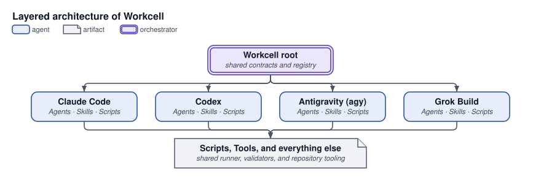

# Workcell

**A multi-agent coding system for Claude Code, Codex, and Antigravity — one agent writes each task's tests, a different one makes them pass, and mechanical gates decide, not promises.**

Like an industrial workcell, it organizes specialized operators and mechanical gates around one bounded unit of work. It turns a goal into a reviewable plan, then runs coding agents in parallel without losing human approval, test evidence, ownership boundaries, or a resumable GitHub record. One repository, three harnesses, the same agents and skills in each.

## Lifecycle

```
Plan → Approve → Tests → Build → Review → Integrate → Merge → Docs → Deploy
```

| Stage     | Who          | What has to be true before the next stage                                |
| --------- | ------------ | ------------------------------------------------------------------------ |
| Plan      | `planner`, reviewed by orchestrator | Recorded brief for a bounded change; sidecar and folio for a milestone |
| Approve   | you (human)  | Explicit approval — silence is never consent                             |
| Tests     | `specifier`  | RED is real and honest, then sealed                                      |
| Build     | `builder`    | Implements against tests it cannot edit                                  |
| Review    | `reviewer`   | No `critical`/`high` finding left standing                               |
| Integrate | `integrator` | Combined wave retested, evidence returned                                |
| Merge     | orchestrator | Reads gate output, never a claim                                         |
| Docs      | `documenter` | READMEs and ADRs match reality                                           |
| Deploy    | `deployer`   | Fresh, explicit approval; verified; reversible                           |

## Workflows

Start with the outcome you want. The orchestrator asks whether you want one plan or multiple plan ideas unless you already specified the choice. Planners author approaches and direct researchers; the orchestrator compares and reviews their results. Plans default to Markdown. An explicit visual/HTML request adds a companion.

`build` is the shared implementation workflow for features, fixes, refactors, and optimizations. Standalone `plan`, `review`, and `profile` produce artifacts and offer build for actionable follow-up. Requests that already authorize implementation continue without another question. `docs` also runs independently, and documenters contribute inside build before final verification.

Research remains a specialist capability inside planning; the standalone research skill is retired. Team sizes follow useful independent work and user constraints, with no workflow-imposed count. See the [developer workflow guide](docs/developer-workflows.md).

## Quick Start

One command. It installs [apm](https://github.com/microsoft/apm) when absent, then the external
tools, then the plugin — everything at user (global) level.

```sh
git clone https://github.com/anvil008/workcell
cd workcell

scripts/bootstrap.sh
```

It is a thin orchestrator over two scripts you can also run (and re-run) individually:

```sh
scripts/bootstrap-tools.sh --install     # 1. external dependencies + the tdd-guard gate
scripts/bootstrap-plugins.sh             # 2. the workcell plugin, into every harness found
```

Run either script with no flags to see what it _would_ do first. Useful flags for the second:

```sh
scripts/bootstrap-plugins.sh --harness claude   # one harness only (claude | codex | agy)
scripts/bootstrap-plugins.sh --uninstall        # remove everything it installed
```

It never overwrites something it does not own — a destination that is not its own copy is refused
by name, and an uninstall leaves anything you have since edited in place and says so. Model/effort
configuration, a per-project install, and upgrading from an earlier install are covered in
**[docs/install.md](docs/install.md)**.

## All 12 skills

Ten workflows and two auxiliary skills share ten specialist roles.

| Type | Skill | Outcome |
| --- | --- | --- |
| Plan | [`plan`](skills/plan/SKILL.md) | One plan or alternative ideas, with planner-owned research |
| Change | [`build`](skills/build/SKILL.md) | Shared implementation, independent review, documentation, and final verification |
| Change | [`debug`](skills/debug/SKILL.md) | Reproduce and isolate a cause, then build the fix |
| Change | [`refactor`](skills/refactor/SKILL.md) | Preserve behavior through the shared build path |
| Change | [`review`](skills/review/SKILL.md) | Independently verified diff or codebase findings |
| Change | [`profile`](skills/profile/SKILL.md) | Reproducible performance baseline and hotspot report |
| Change | [`docs`](skills/docs/SKILL.md) | Independently validated documentation |
| Prepare | [`repo-setup`](skills/repo-setup/SKILL.md) | Repository instructions, runners, and quality gates |
| Operate | [`deploy`](skills/deploy/SKILL.md) | Authorized release, verification, and rollback readiness |
| Operate | [`wiki`](skills/wiki/SKILL.md) | Opted-in project knowledge and immutable evidence |
| Auxiliary | [`jj`](skills/jj/SKILL.md) | Jujutsu version control |
| Auxiliary | [`use-other-harness`](skills/use-other-harness/SKILL.md) | Explicit user-requested execution in another harness |

Single changes and dependency runs are build's internal execution shapes. The old simple-build, complex-build, new-feature, code-refactor, code-analysis, code-review, perf, research, and review-fix-loop entrypoints are retired. Codebase audits live in review; review and profile use the same authorized build transition.

The wiki records project knowledge outside the repository only after opt-in. Immutable raw traces and append-only patterns preserve evidence; shared workflows change through reviewed source changes.

## Who does what

| Agent                              | Writes                                    | Owns                                                      | Never                                                            |
| ---------------------------------- | ----------------------------------------- | --------------------------------------------------------- | ---------------------------------------------------------------- |
| orchestrator (you, in the harness) | decisions and run records | requirements, budgets, dispatch, plan review, gates, scheduling, completion | implementation, runnable acceptance tests, independent verification |
| `planner`                          | draft plan artifacts                            | investigation, folio, sidecar, acceptance tests           | touches the target project; writes GitHub; answers for the human |
| `specifier`                        | tests                                     | the Definition of Done: real RED, then the seal           | writes an implementation, makes its own test pass                |
| `builder`                          | implementation                            | one issue, one retained workspace, one local commit                          | edits sealed tests, pushes `main`, merges its own PR             |
| `reviewer`                         | nothing                                   | one assurance lens over one change-set                    | edits anything it reviews                                        |
| `debugger`                         | temporary instrumentation only            | reproducing a symptom and finding its cause by experiment | ships the fix, leaves instrumentation behind                     |
| `profiler`                         | nothing                                   | measurement: distributions, run counts, conditions        | edits anything it measures, reports a single run                 |
| `integrator`                       | nothing                                   | the combined-wave run and its evidence                    | merges to `main`, fixes what it finds, decides                   |
| `researcher`                       | findings envelope (returned, not written) | one assigned area, evidence-backed                        | writes report artifacts; draws the conclusion                    |
| `documenter`                       | docs                                      | READMEs, ADRs, changelogs, the docs gate                  | product code                                                     |
| `deployer`                         | release artifacts                         | one approved release, verify, rollback                    | deploys without a fresh, explicit approval                       |

The boundary is written down in [ADR 0029](docs/adr/0029-composable-workflows-and-native-research.md);
the dispatch and return shape every agent uses is [`agents/handoff.md`](agents/handoff.md)
([ADR 0008](docs/adr/0008-agent-handoff-contract.md)).

## How it works

**Planners author plans; the orchestrator reviews evidence and manages completion.** It frames distinct approaches, preserves user choices, and requests revisions or a material decision when needed. Researchers investigate for their planner. Implementation, runnable tests, and independent verification remain specialist responsibilities. GitHub issues are optional; local task IDs and immutable source receipts support dependency runs without them.

<picture>
  <source media="(prefers-color-scheme: dark)" srcset="docs/diagrams/how-work-moves-dark.svg">
  
</picture>

Dependency runs use single-PR mode with one final delivery. Build reuses its input plan or findings, fills missing executable detail, and schedules independent work by ownership and dependencies. A specifier seals RED for behavior changes; an integrator seals GREEN for behavior-preserving changes. Builders implement and obtain independent review. Review iterations follow the evidence and explicit user limits, without a fixed workflow quota.

The integrator verifies combined source commits. Relevant documentation is combined before the final verification, and performance changes are remeasured against their baseline. The orchestrator records accepted source receipts, preserves recovery workspaces, and checks the exact final PR head before an authorized merge. Deploy remains separate. A model's claim of success cannot replace command evidence.

**Authorship is separated and enforced by `tdd-guard`.** A `specifier` proves RED and seals the
tests; the `builder` implements against them and is mechanically denied any edit to a sealed path.
For behaviour-preserving `refactor`/optimization work, an `integrator` instead proves the baseline
GREEN and takes a **baseline seal** — no `specifier`, no touched tests. Either way the Stop hook
refuses to let the builder finish without fresh GREEN evidence that postdates the seal and matches
the current source and base. A failed verification discards any previous success.

<picture>
  <source media="(prefers-color-scheme: dark)" srcset="docs/diagrams/mechanical-gates-dark.svg">
  
</picture>

In words: the agent judged by the tests is never the agent who wrote them, and the guard — not a
convention — is what makes that true. A `specifier` proves RED and seals, or for
behaviour-preserving work an `integrator` seals a green baseline; the `builder` then implements, and
an edit of a sealed path is denied rather than warned about, amendable only through
`reseal --reason`. `verify` binds a passing run to the current source and base, `diff-review record`
binds findings to the current diff, and the Stop hook allows the builder handoff only when all of that
evidence is fresh — otherwise it sends the builder back. The full gate-by-gate walkthrough is
**[docs/gates.md](docs/gates.md)**; the mode is [ADR 0009](docs/adr/0009-skills-are-dispatch-contracts.md).

## How the repository is laid out

<picture>
  <source media="(prefers-color-scheme: dark)" srcset="docs/diagrams/layered-architecture-dark.svg">
  
</picture>

In words: the Workcell root defines shared contracts feeding three harness families—Claude, Codex, and Antigravity (agy)—where each family owns its native Agents, Skills, and Scripts, operating alongside shared Scripts, Tools, and everything else.

```
workcell/
├── contracts/          harness-contracts.json declaring cross-harness requirements for 10 agents and 12 skills
├── harnesses/          three harness-owned families: claude/, codex/, agy/
│   ├── claude/         harness-native agents, skills, and runtime (.claude-plugin/plugin.json, hooks/)
│   ├── codex/          harness-native agents, skills, and runtime (.codex-plugin/plugin.json, models.json)
│   └── agy/            harness-native agents, skills, and runtime (plugin.json, rules/) — staged, then copied as an owned copy to ~/.gemini/config/plugins/workcell; never linked
├── agents/             agent source definitions and metadata synced to harnesses via sync-agents.py
├── skills/             canonical workflow definitions synced to harnesses via sync-skills.py
├── plugins/            thin distribution wrappers
├── scripts/            stagers (build-claude-plugin.py, build-codex-plugin.py, build-agy-plugin.py), synchronization, and validators
├── cmd/tdd-guard/      the gate binary binding RED, GREEN, and review evidence to one diff
├── docs/adr/           architecture decisions and their consequences
├── docs/workspaces.md  the one isolation standard: workcell-ws, sibling paths, the sweep
├── docs/diagrams/      the README's visuals: JSON sources in src/, generated light and dark SVG
└── evals/              structural, routing, and behavioral checks on skills and agents
```

`plugins/claude/`, `plugins/codex/`, and `plugins/agy/` provide thin native wrappers:
a manifest, hooks, and references to shared content where the harness layout needs them.
Antigravity’s per-skill entries regenerate on install from `skills/` minus the skills owned
by one of its agents. The supported harness set is defined in [ADR 0029](docs/adr/0029-composable-workflows-and-native-research.md).

Codex routes use **GPT-6 Astra**, preserving each role's reasoning effort in
[`agents/models.json`](agents/models.json). See the [Astra prompting guide](docs/models/gpt-6-astra/prompting.md).
The executable [local build protocol](docs/build-runs.md) documents prepare, accept, resume, and cleanup.
The [interactive system map](docs/diagrams/system-map/README.md) can be served locally.

Every harness install is an installer-owned copy of a staged tree. The three scripts
`build-claude-plugin.py`, `build-codex-plugin.py`, and `build-agy-plugin.py` stage trees with
no links escaping them; `scripts/bootstrap-plugins.sh` copies each tree to its owned path.
Claude and Codex use a durable marketplace under `~/.local/share/workcell/`. Antigravity
scans its owned copy at `~/.gemini/config/plugins/workcell`. These are real directories,
not links to this checkout. The former `~/.gemini/antigravity-cli/plugins/workcell` path is retired; refresh and removal details are in [docs/install.md](docs/install.md).

## Evals

Three tiers, from [`evals/README.md`](evals/README.md):

1. **Structural** (free, CI) — skill frontmatter, case coverage, trigger counts, fixture paths.
2. **Routing** (free, CI) — TF-IDF cosine ranking; positive prompts must retrieve their case,
   negatives must prefer their declared owner.
3. **Behavioral** (on demand, spends tokens) — runs Claude Code or Codex headlessly against a
   fixture repo and grades the trace.

```sh
python3 evals/run_evals.py --structural
python3 evals/run_evals.py --min-rank1 77
python3 -m unittest discover -s evals/tests -p 'test_*.py'
```

## Verify the repository

The same substantive checks CI runs (shell test suites can also be run concurrently via `bash scripts/run-tests.sh`):

```sh
python3 -m pip install ruff
go mod tidy
git diff --exit-code -- go.mod go.sum
go build ./...
go vet ./...
go test -count=1 -race ./...
bash scripts/hooks/tests/test_hooks.sh
bash scripts/hooks/tests/test_plugin_hooks.sh
bash scripts/tests/test_install.sh
bash scripts/tests/test_workcell_ws.sh
python3 -m unittest discover -s scripts/tests -p 'test_*.py'
ruff check skills/ evals/ scripts/render-diagrams.py
shellcheck -S warning scripts/*.sh scripts/hooks/build-* scripts/workcell-ws
for d in skills/*/tests; do python3 -m unittest discover -s "$d" -p 'test_*.py'; done
python3 -m unittest discover -s skills/plan/research/tests -p 'test_*.py'
python3 evals/run_evals.py --structural
python3 evals/run_evals.py --min-rank1 77
python3 -m unittest discover -s evals/tests -p 'test_*.py'
python3 skills/docs/scripts/docs_check.py .
python3 scripts/sync-agents.py --check --diff
python3 scripts/sync-skills.py --check --diff
python3 scripts/check-contract-parity.py
python3 scripts/sync-agent-models.py --check
python3 docs/models/check/check_guides.py --check
python3 scripts/render-diagrams.py --check
python3 scripts/check-harness-bodies.py
```

Architecture decisions live in [`docs/adr/`](docs/adr/); notable changes are summarized in
[`CHANGELOG.md`](CHANGELOG.md).

## Contributing

Workcell uses a layered architecture across three harness families: Claude Code, Codex, and Antigravity (`agy`) ([ADR 0025](docs/adr/0025-layered-architecture-and-harness-owned-instructions.md)). Shared contracts in [`contracts/harness-contracts.json`](contracts/harness-contracts.json) define machine-readable requirements, while each harness family owns native instruction bodies and runtime adapters under `harnesses/<harness>/{agents,skills,runtime}`.

**Adding or modifying an agent:**

- Update shared interface contracts in `contracts/harness-contracts.json` if required interfaces or surfaces change.
- Author harness-native instruction bodies under `harnesses/<harness>/agents/` tailored to each model's prompting style.
- Keep definitions in sync using `scripts/sync-agents.py` and models using `scripts/sync-agent-models.py`.

**Adding or modifying a skill:**

- Define shared tool requirements and interface entries in `contracts/harness-contracts.json`.
- Author canonical workflow instructions under `skills/<name>/SKILL.md` and harness-owned variants under `harnesses/<harness>/skills/`.
- Synchronize workflow definitions across harnesses with `scripts/sync-skills.py`.

**Mechanical gates and staging:**

- Validate that harness bodies preserve all procedures, commands, tables, links, and contract strings with the body checker:
  ```sh
  python3 scripts/check-harness-bodies.py
  ```
- Verify contract parity and synchronization before committing:
  ```sh
  python3 scripts/check-contract-parity.py
  python3 scripts/sync-agents.py --check --diff
  python3 scripts/sync-skills.py --check --diff
  ```
- Stage standalone distribution plugin trees for each harness via the three stagers:
  ```sh
  python3 scripts/build-claude-plugin.py
  python3 scripts/build-codex-plugin.py
  python3 scripts/build-agy-plugin.py
  ```

**Generated output policy:**
Generated outputs (`dist/`, `harnesses/<harness>/runtime/contracts.json`, staged plugin trees, etc.) are non-editable outputs. Hand edits will fail CI checks (`--check`) or be overwritten by synchronization tools and stagers.
