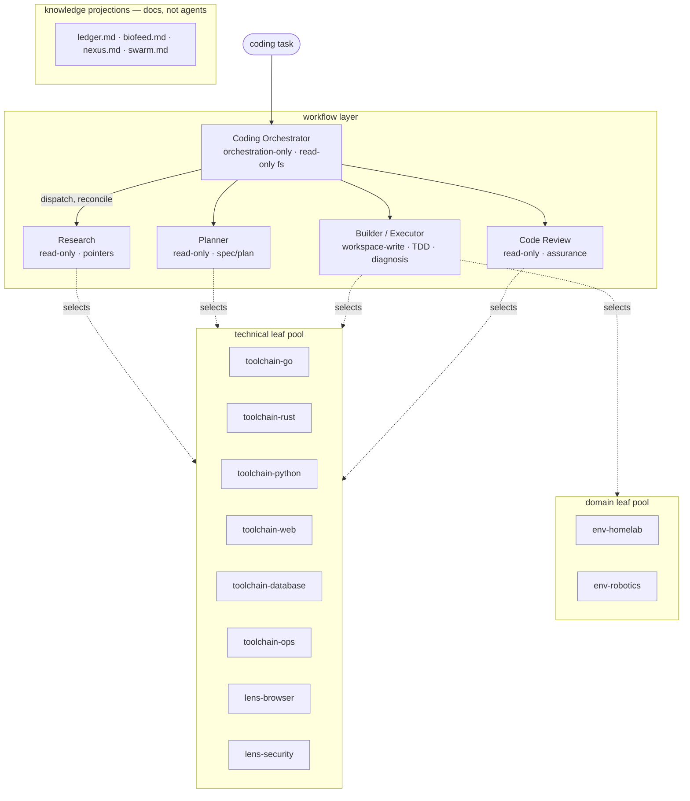
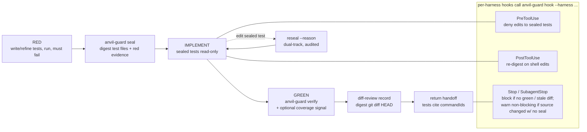
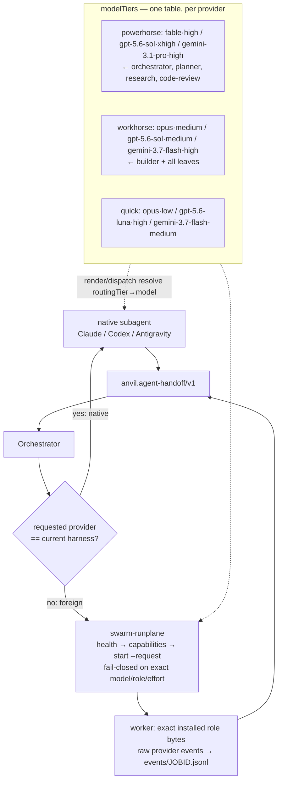
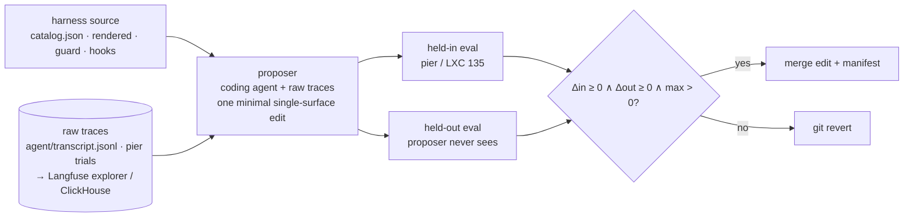

# Anvil Coding Fleet — architecture

The Coding Fleet is a provider-neutral role **catalog**
(`harness-agents/canonical/catalog.json`) rendered to native Claude Code, Codex,
and Antigravity agent definitions, plus a Go **control plane** that makes
verification mechanical rather than prose-based. This document diagrams the
system as built (Phases 1–4). Each diagram is followed by a short text summary so
it is readable without a Mermaid renderer.

---

## 1. Fleet topology

One orchestrator, four peer workflow units, two shared leaf pools (verifier
profiles + review lenses + environment roles), and five knowledge projections
that are documents, not agents.



**Text:** The orchestrator (no write authority; reads the repo only to reconcile
handoffs) dispatches exactly four peers — Research, Planner, Builder, Code
Review — and alone declares completion. Builder is the only writer and now owns
diagnosis (Debugger folded in). Each peer dynamically selects leaf specialists
from two pools: **technical** (six `toolchain-*` verifier profiles differentiated
by their command sets, plus `lens-browser` and `lens-security` read-only review
lenses) and **domain** (`env-homelab`, `env-robotics`, differentiated by
environment/guardrails). Evaluation and Factory were removed from this swarm
(they run as a separate process). Five product-context roles became repo
documentation under `harness-agents/rendered/knowledge/<repo>.md`, not agents.

---

## 2. TDD + guard enforcement (mechanical, all three harnesses)

`anvil-guard` makes test-first unconditional and un-bypassable, enforced by
harness hooks rather than prompt text.



**Text:** Every code change goes RED → `seal` → IMPLEMENT → GREEN → diff-review,
on the bounded direct route as well as planned work. Sealed test paths are
read-only during implementation; refining tests is a normal **dual-track** move
via `reseal` (audited, red-property preserved) — not an exception. Hooks
installed in Claude (`~/.claude/settings.json` + subagent frontmatter), Codex
(`~/.codex/hooks.json`, one-time `/hooks` trust), and Antigravity
(`~/.gemini/config/hooks.json`) call one harness-neutral `anvil-guard hook
--harness claude|codex|agy` binary. The Stop gate blocks on a missing green or
stale diff-review; the unsealed-source-change case is a **non-blocking** warning
(exit 0 + `systemMessage`, so it never wedges a non-Builder session). Repos with
no seal are untouched (hooks exit 0).

---

## 3. Control-plane evidence contracts

Terminal success is a validated record, not narrative. Every claim resolves to a
guard-produced record; agent-authored booleans do not count.

```mermaid
flowchart TD
  subgraph GUARD[anvil-guard state · per-repo]
    SEAL[seal.json<br/>test digests + red CommandEvidence]
    GREEN[green.json<br/>green CommandEvidence + coveragePercent]
    DIFF[diff-review.json<br/>diff digest + findings]
    ARCH[arch-review.json<br/>ast-grep assertions + results]
  end
  subgraph CP[controlplane records]
    H[AgentHandoff<br/>tests[].commandId]
    WR[WorkflowResult<br/>DiffReview · ArchReview]
    VS[VerificationState<br/>TestSeal · 2 passes / 1 repair]
  end
  SEAL --> VS
  GREEN --> VS
  DIFF --> WR
  ARCH --> WR
  H -->|commandId must resolve to a guard record<br/>passed must match exit code| GUARD
  WR --> DEC{disposition}
  DEC -->|guard-backed + green| SUCC[succeeded]
  DEC -->|forged / no executed command| REJ[rejected / unverified]
```

**Text:** `AgentHandoff.tests[]` carry `commandId`s that must resolve to a real
`anvil-guard` record with a matching exit code — a fabricated id is rejected
(proven by the `forged-command-id` conformance fixture). `VerificationState`
seals the test digests and bounds repair to two passes / one repair.
`WorkflowResult` carries `DiffReview` (execution lane) and the additive
`ArchReview` (executable structural conformance). Assurance/evaluation results
with zero executed commands are `unverified`, never pass/warn.

---

## 4. Dispatch + model tiers

Same-provider work uses the harness's native subagents; only cross-provider work
uses the `swarm-runplane` supervisor. Model IDs live in one tier table.



**Text:** A role's `routingTier` names a tier; `render.go` (and dispatch) resolve
`modelTiers[tier][harness]` → concrete model+effort, so model churn is a
one-file edit. The run-plane embeds the catalog at build time — it must be
rebuilt whenever the catalog/tiers change, or foreign dispatch silently drops
changed roles. Foreign runs return the same `anvil.agent-handoff/v1` record as
native ones; the parent retains all lifecycle and completion authority.

---

## 5. External improvement loop (separate process — design)

Evaluation and harness self-improvement run **outside** this swarm so the thing
being improved never controls its scorer. Design in
`docs/plans/external-improvement-loop.md`.



**Text:** A proposer (a fleet coding agent with full raw-trace file access)
emits one minimal edit; it is promoted only if it regresses neither the held-in
nor the held-out split and improves at least one (Self-Harness's rule), else
git-reverted. The evaluator (pier's oracle) is fixed and distinct from the
proposer, model frozen. Raw multi-agent transcripts are retained as files for the
proposer; **Langfuse** is the human explorer on top of the existing ClickHouse
trace store, not the loop's data path.

---

## Source map

| Concern | Files |
|---|---|
| Role catalog + tiers | `harness-agents/canonical/catalog.json` |
| Rendering | `codingfleet/render.go`, `harness-agents/rendered/**` |
| Guard (TDD, arch-check) | `guard/`, `cmd/anvil-guard/` |
| Control-plane contracts | `controlplane/` (`result.go`, `verification.go`, `guard.go`) |
| Foreign dispatch | `runplane/`, `cmd/swarm-runplane/` |
| Installer + hooks | `codingfleet/install.go`, `codingfleet/hooks.go` |
| Adoption + roadmap | `docs/plans/agentic-harness-directives-adoption.md` |
| Research feedback | `docs/plans/research-papers-harness-feedback.md` |
| External loop design | `docs/plans/external-improvement-loop.md` |
