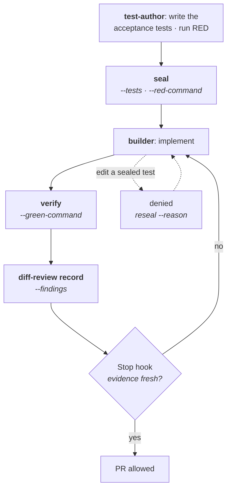

# Mechanical gates

The build wave is bound by `tdd-guard`, which turns TDD from a promise into a state machine — and, because the `test-author` seals and the `builder` implements, into a state machine two different agents pass through. The
guard is a real binary (`cmd/tdd-guard/`, `guard/`), installed by `bootstrap-tools.sh`; the
`scripts/hooks/build-*` commands are what wire it into a harness's tool events.

In words: a `test-author` proves RED and seals the tests; a `builder` implements against
them, denied any edit to a sealed path; `verify` accepts only a GREEN run that postdates
the seal; a `diff-review` record binds findings to the current diff; and the Stop hook
lets a PR through only when all of that evidence is fresh. An out-of-band edit to a sealed
test is denied and routes back through `reseal`, never silently accepted.

In detail, and in the order the wave hits them:

1. **`tdd-guard seal --tests <globs> --red-command <argv...>`** records the exact failing command and
   a digest of every sealed test file. RED has to be real and non-zero before the seal is taken — and
   _honest_: a test failing with `ImportError` proves nothing about behaviour, so the `test-author`
   writes signature-only stubs where needed to make the failure land on the assertion.
   For behavior-preserving `code-refactor` and `perf` work, the orchestrator creates the workspace
   and an `integrator` in `mode: baseline` instead runs
   **`tdd-guard seal --tests <globs> --green-baseline <argv...>`** after that command passes. This
   produces a green `kind: baseline` seal; the `builder` receives it in `mode: refactor`, with no
   `test-author` and untouched tests. The red requirement is replaced by a green one, while sealed
   paths, post-seal verification, diff review, handoff, status, and Stop use the same state machine.
2. **While implementing, sealed tests are read-only** — and they are not the builder's tests. A `PreToolUse` edit of a sealed path is
   _denied_, not warned about; changing one out-of-band is flagged the moment the guard sees it. The
   only legitimate amendment is `tdd-guard reseal --reason <text>`, after proving the amended test
   fails for the intended reason.
3. **`tdd-guard verify --green-command <argv...>`** accepts the run only if the tests are byte-identical
   to the seal and the GREEN run _postdates_ it. Optional `--coverage-command` and `--min-coverage`
   add a coverage floor; `tdd-guard arch-check --assertions <file>` asserts structural invariants.
4. **`tdd-guard diff-review record --findings <file>`** binds review findings to the current diff. Change
   the diff afterwards and the record goes stale.
5. **`tdd-guard handoff --to builder`** ends the `test-author`'s turn. The Stop gate is written for an
   implementer, so without this a sealing agent would deadlock on GREEN evidence it is not allowed to
   produce. It relaxes the Stop gate only — `ready` stays false until the implementation exists.
6. **The Stop hook refuses to let a builder finish** while any of that is missing: sealed tests changed
   without a recorded amendment, no green evidence, green evidence older than the current seal, or a
   missing/stale diff review. `tdd-guard status --json` reports the same state for a human or the
   orchestrator, and it is the gate that decides a merge — a handoff never satisfies it.

Runtime verification is a contract-level gate, not a mechanical one. Between GREEN and its review
passes the `builder` must run the surface it changed — a browser for UI, `curl` against a started
service, the real command for a CLI — and record what it ran in the handoff's `evidence.runtime`
([contract](../agents/handoff.md)); a change with no runnable surface says so instead. The Stop hook
still gates only on `tdd-guard` state and knows nothing about this, so it is the builder's definition
of done and the orchestrator's evidence to read, not something a hook can prove. A suite that passes
proves the tests pass; only running the thing proves it runs.

Alongside the TDD state machine, `build-guard` inspects each shell command _before_ it runs and fails
closed on malformed tool payloads, protected-branch mutations, unsafe Git/jj/GitHub operations, and
RAM-tmpfs build targets. `build-format` and `build-lint` auto-format written files and feed
single-file lint findings back to the agent.

Merging is the one thing it decides by _who asked_. `gh pr merge` and the `pulls/<n>/merge` API path
belong to the main conversation: Claude Code and Codex stamp the calling subagent's `agent_id` and
`agent_type` into the hook payload and omit both for their own top-level session, so the payload —
not the environment, which is identical either way — is the discriminator, and the rule is uniform
across those two harnesses. Antigravity registers hooks session-wide and names no caller at all, so
merges there stay denied whoever asked. `--admin` and `--auto` are denied for everyone, the main
conversation included: an orchestrator's merge is an ordinary merge of a reviewed, green pull
request, never an override of a red check nor one armed to fire on checks no human has read. ADR
0011 records the decision and its residual risk.

Claude Code, Antigravity, and Codex wire these to native tool events. Codex plugin hooks remain
inactive until the user trusts them with `/hooks`, so its agent definitions also document explicit
`build-guard codex` and `tdd-guard` commands as the fallback for untrusted or ad-hoc sessions.
