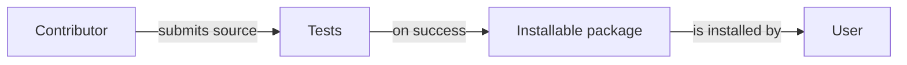

# Parcel

Parcel turns a checked source tree into a tested package. It exists to give contributors one repeatable path from a local change to an artifact users can install.

## Quickstart

```bash
parcel build
```

## How it works



In words: a contributor submits source, the test suite checks it, and a passing run produces an installable package for the user. Failed tests stop the package from being produced.
